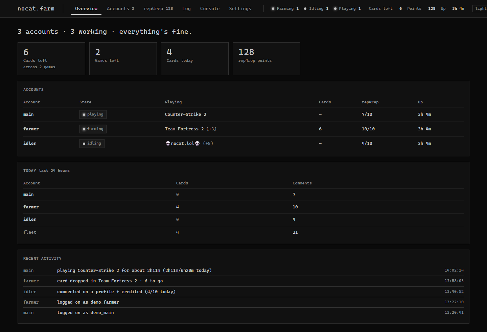
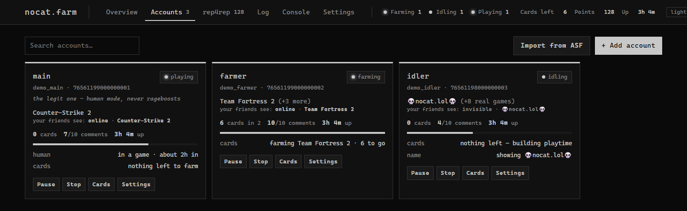

# nocat.farm


A Steam idler, trading-card farmer and — if you want it — rep4rep commenter. One small Windows app with a web
dashboard beside it. It sits in the tray, runs every account in the background all day, and is built to look
like a person doing it rather than a bot.

<p align="center">
  
</p>

**Everything stays on your machine.** Your accounts, login tokens and logs never leave it. The only things that
touch a third party are opt-in and off by default — see [Privacy](#privacy-and-safety).

---

### Contents

[Building it](#building-it) · [What it does](#what-it-does) · [Three ways to drive it](#three-ways-to-drive-it)
· [Getting started](#getting-started) · [Human mode](#human-mode) · [rep4rep](#rep4rep) ·
[Commands](#commands) · [Achievements](#achievements) · [Trades, keys & items](#trades-keys-and-items) ·
[Settings](#settings) · [Privacy & safety](#privacy-and-safety)

### Building it

**Just want to run it?** Grab the latest `nocat.farm-v*.zip` from
[Releases](https://github.com/VisaHolder/nocatfarm/releases), unzip it anywhere, and run `nocatFarm.exe`. The
release build is self-contained — no .NET install, nothing else to set up.

To build from source instead, you need the [.NET 10 SDK](https://dotnet.microsoft.com/download). Nothing else —
there is no npm step, no bundler, and the dashboard is plain static files.

```
git clone https://github.com/VisaHolder/nocatfarm.git
cd nocatfarm
dotnet publish src/NocatFarm -c Release -o run
run\nocatFarm.exe
```

`run/` is deliberately not in the repository — it is where your accounts, login tokens and logs end up, and
none of that belongs in version control. The publish step creates it.

First run creates `config/`, prints the dashboard URL, and tells you the one command you need.

Everything is local. Accounts never leave the machine. Only two features ever talk to a third party, both
**off by default** and opt-in: **rep4rep** (a comment-exchange site — the whole feature is hidden until you
turn it on), and **Claim free games** (reads a public list of current Steam giveaways). Leave them off and
nothing but Steam is ever contacted.

---

## What it does

| | |
|---|---|
| **Idling** | Plays any set of appIDs for playtime, and re-asserts them, so a network hiccup doesn't silently stop it. |
| **Custom game name** | Shows a non-Steam name (e.g. `nocat.lol`) on your profile and friends list **while the real games keep banking playtime**. Both at once. |
| **Card farming** | Reads your own badge pages, bumps playtime on under-threshold games 32 at a time, then farms them solo. Drops are detected from Steam's item-announcement **push**, not a timer, so a finished game is noticed in seconds. |
| **rep4rep** | Posts the comments rep4rep assigns, on a human schedule, from every opted-in account — all into one points pool. |
| **Comment alerts** | Steam pushes the moment somebody comments on one of your profiles; it hits the log and a tray balloon. |
| **Stays out of your way** | Launch a game yourself and every account stands down, then quietly picks back up after a delay you choose. |
| **Daily report** | Once a day (default 09:30) it writes a one-look summary to the log: hours banked in the last 24h, cards, rep4rep comments and a running total, per account. Type `report` for it on demand. |

<p align="center">
  
</p>

## Three ways to drive it

**Console** — the primary interface. Type `help`. Up-arrow history, tab completion in the browser console,
and `help <setting>` explains any setting in one sentence.

**Tray** — right-click for Open dashboard · Hide console · Start/Stop all · Exit. Minimising the console hides
it. `--minimized` boots straight to the tray with no window at all, and *Start with Windows* wires that up for
you.

**Dashboard** — `http://127.0.0.1:7242/`. Overview · Accounts · rep4rep · Log · Console · Settings.
Turn it off with `set WebEnabled false` and nothing is lost.

---

## Getting started

Type `tutorial`. It walks the six steps in order and ticks off the ones this machine has already done, so the
next thing to do is always the first unticked line. `tutorial cards`, `tutorial human`, `tutorial rep4rep`,
`tutorial trades`, `tutorial achievements` and `tutorial tray` go deeper on one thing each.

The short version:

```
add myaccount steamlogin      # asks for the password + Steam Guard code, once
play myaccount 730, 440       # idle CS2 and TF2
name myaccount nocat.lol      # show this instead of the real game
```

Card farming is already on, and cards come first: it works through everything with cards left, then falls back
to idling that list. `cards myaccount` shows what's outstanding.

The password is asked for **once per account**. After that a Steam refresh token in `config/tokens/` does the
logging in — restarts are silent, no Guard code, no password. You never have to store a password in a file.
Drop an account's `maFile` into `config/authenticators/` and it answers its own Steam Guard prompts forever.

**Coming from ArchiSteamFarm?** `import asf` brings every bot across *with its login token* — no passwords, no
Guard codes — plus its games, custom name, farming order and rep4rep settings, and its authenticator if ASF had
one. ASF's `FarmingPreferences`, `BotBehaviour`, `TradingPreferences` and `SteamUserPermissions` bitfields are
unpacked into the individual settings here.

## Human mode

The part that separates this from an idler. Turn it on per account and it plays like a person instead of a bot:

* weekdays and weekends have different shapes, and roughly one day in twenty it doesn't play at all
* one game at a time, in sittings of believable length, with a main game that takes most of the week
* other games arrive in **bursts** rather than the same slice every single day — an even daily drip is the
  loudest pattern a farming account leaves
* short breaks, proper meal breaks around real meal times, and some of those spent appearing offline
* a settling-in gap after signing in, because nobody launches a game the second Steam opens
* offline overnight, where it can still bank hours invisibly

```
set myaccount LegitMode true
set myaccount GameWeights "730:70, 440:20, 550:10"    # first game is the main one
human myaccount week                                   # the week it rolled, as a sample
```

While it's on, the settings that would give an account away are hidden **and cleared from the config** — and
put back exactly as they were if you turn it off.

## rep4rep

rep4rep is a third-party site where users trade profile comments. It's **entirely optional and off by
default** — the whole feature (its tab, its points, its per-account options) stays hidden until you switch it
on under **Settings → rep4rep account → "Use rep4rep at all."** Most people won't want it; leave it off and
nothing rep4rep-related ever runs or appears.

If you do want it: turn it on, open the **rep4rep** tab and paste your API token (from rep4rep.com → Settings).
It's validated before it's saved, so a typo can't silently stop every account commenting. Then switch it on
per account.

Steam's ceiling for comments on people who aren't your friends is about **10 per rolling 24 hours, per
account**. That ceiling is enforced here and the count is **persisted**, so a restart can't reset it — which is
the mistake that actually gets accounts comment-banned. If the state file can't be read, nobody comments: fail
safe, not fail open.

The pacing, all per account:

* a commenting window (default 10:00–23:00), staggered per account per day
* 10–25 minutes between one account's comments, jittered
* a refused post gets **one** retry, then that *profile* is skipped for 26h and a different one is tried
* only when **three different profiles** refuse in a row is the *account* treated as blocked — 24h off, while
  the other accounts carry on
* an unknown outcome is counted and never retried (Steam may have posted it; a retry would double-comment)

Points appear as **pending** first — that's rep4rep verifying the comment really landed, usually within a few
hours. Nothing is lost.

Removing a profile, editing your comment list, task history, buying points and referrals have no API. The
dashboard links out to rep4rep.com for those rather than pretending.

---

## Commands

`help` lists everything; `help <setting>` explains any setting. The dashboard's console runs the same commands
and prints the same output.

```
status [account]                     start|stop|restart|pause|resume <account|all>
add <name> <steamLogin>              remove <account>       enable|disable <account>
play <account> <appIDs|none>         name <account> [text]  persona <account> <state>
cards [account]                      farm <account> on|off
rep4rep status|points|profiles|tasks|on|off|now|pause|resume|clear
config [account]                     set [account] <key> <value>      reload
log [count]                          stats [hours]          report
version                              exit
```

## Achievements

```
cheevo myaccount 730                  # what it has, easiest first, with how rare each one is
cheevo myaccount 730 unlock all       # all of them, now
cheevo myaccount 730 unlock ACH_NAME  # just one
cheevo myaccount 730 lock ACH_NAME    # put one back
```

Unlocking a whole list at once is permanent, stamped with one shared timestamp, and visible on the profile
forever — so for an account meant to look real there's a drip instead: `set myaccount UnlockAchievements true`
earns a few a day, **easiest first** (the ones most owners have are the ones you get by simply playing), and
only in a game the account actually has open.

## Trades, keys and items

```
set myaccount AcceptDonations true      # offers that ask for NOTHING - can never cost the account anything
set myaccount TradeMasters 7656119...   # accounts you own
set myaccount AcceptFromMasters true    # let those take items
send myaccount                          # sweep its cards to the first master
redeem AAAAA-BBBBB-CCCCC                # tries each account until one can use the key
2fa myaccount                           # its current Steam Guard code
```

A donation is an offer where you give up nothing at all. An offer asking for even one of your items is not a
donation and is never accepted on that rule — only accounts on your own masters list can take anything. If a
side of the trade page can't be read, the offer is refused rather than guessed at.

## Settings

**41 global, 99 per account.** Every one has a plain-English explanation attached to it, which the dashboard
shows on hover and the console prints for `help <setting>` — one sentence, written once, in
`Config/Settings.cs`. Advanced settings are collapsed by default and never move.

Global: the dashboard (host/port/password/auto-open), background behaviour (tray, minimise-to-tray, start with
Windows, keep-awake, three notification categories), the rep4rep account, the Steam connection (login stagger,
reconnect, timeout, farming concurrency, rate-limit cooldown, web request spacing, protocol, proxy), and
logging with retention.

Per account: identity and appearance (persona, device type, notes, start-paused, Family View PIN, device
name), what it plays, trading cards (order, priority list, blacklist, refund protection, skip-unplayed,
give-up time, log out when done), rep4rep pacing, friends & messages (accept requests, auto-reply, command
masters, and joining the nocat.farm Steam group — on by default, `set <account> JoinGroup false` to opt out),
and *Staying out of the way*.

`config/nocatFarm.json` and `config/<account>.json` are plain JSON with exactly these names. Edit by hand and
run `reload` if you prefer.

## Command line

```
--path <dir>    where config/ and logs/ live (default: next to the exe)
--no-web        don't start the dashboard
--no-tray       no notification-area icon
--minimized     start with the console hidden, straight to the tray
```

---

## Privacy and safety

* **Local only.** Your accounts, passwords, login tokens and logs live on your machine and are never uploaded
  anywhere. `run/` (config, tokens, logs) is git-ignored and is not in this repository.
* **No stored passwords.** A password is typed **once per account**, then a Steam refresh token does the
  logging in — restarts need no password and no Guard code. Drop an account's `maFile` into
  `config/authenticators/` and it answers its own Steam Guard prompts.
* **Opt-in third parties.** rep4rep and *Claim free games* are the only features that contact anything other
  than Steam, and both are off by default (see [rep4rep](#rep4rep) and [Privacy](#privacy-and-safety) above).
* **It never fights you for your account.** Launch a game yourself and every account stands down, then picks
  back up on its own — and on an account you also sign into, it will not throw you off Friends & Chat.
* **The dashboard is yours.** With no password set it refuses every connection that isn't from this PC.
  Secrets are never sent to the browser, and an empty field means "leave unchanged", never "erase it".
* **Steam's rules.** This automates your own Steam accounts; that's against Steam's Subscriber Agreement and
  can get an account limited or banned. It's built to be gentle (human pacing, shared rate-limit cooldowns),
  but you run it at your own risk on accounts you're willing to lose.

## Notes on how it works

* **Web session.** There is no "log in to the website" step. Steam accepts a cookie built locally from the
  access token the Steam connection already handed us: `steamLoginSecure = <steamID64>||<accessToken>`, plus a
  client-chosen `sessionid` that must also be echoed in the body of every POST. An expired token shows up as a
  redirect to `/login` rather than an error, so that redirect is what triggers a re-mint and one retry.
* **Rate limits.** Logins from one machine are serialised with a gap, and everyone shares one cooldown when
  Steam pushes back — three accounts each waiting 25 minutes in series helps nobody. Web requests are spaced
  per host.
* **Occupation.** If you sit down and launch a game, Steam says so, and everything that plays a game stands
  down. It never fights you for your own session.
* **Security.** With no dashboard password set, the dashboard refuses every connection that isn't from this PC.
  Secrets are never sent to the browser and an empty field means "unchanged", never "erase it".

Built on [SteamKit2](https://github.com/SteamRE/SteamKit). The protocol details and the pacing model follow
[ArchiSteamFarm](https://github.com/JustArchiNET/ArchiSteamFarm), which is where the hard-won parts (the
32-games-at-once playtime trick, the badge-page shapes, the login limiter) come from.
