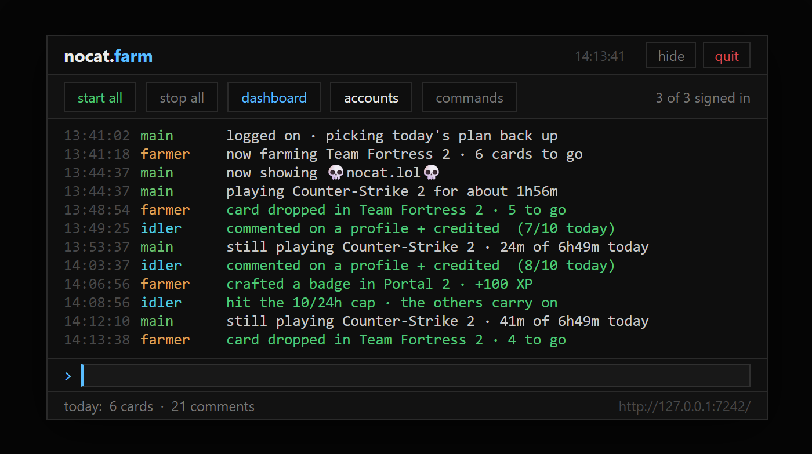

<p align="center">
  
</p>

<h1 align="center">nocat.farm</h1>

<p align="center">
  <b>Farms your Steam trading cards and idles your games - on all your accounts, in the background,<br>
  while looking like a real person is playing.</b>
</p>

<p align="center">
  <a href="https://github.com/VisaHolder/nocatfarm/releases/latest"></a>
  
  
  
  
</p>

<p align="center">
  <a href="https://github.com/VisaHolder/nocatfarm/releases/latest"><b>Download</b></a> ·
  <a href="#what-it-does">What it does</a> ·
  <a href="#get-started-in-2-minutes">Get started</a> ·
  <a href="#mini-mode">Mini mode</a> ·
  <a href="#the-commands-youll-actually-use">Commands</a> ·
  <a href="#is-it-safe">Is it safe?</a> ·
  <a href="#faq">FAQ</a> ·
  <a href="docs/GUIDE.md">Full guide</a>
</p>

---

## What it does

- **Farms your trading cards** on every account, one game after another, and tells you roughly how long is left.
- **Idles games for hours** - up to 32 at once - and can show a made-up game name on your profile (like
  `💀nocat.lol💀`) while the real games keep counting.
- **Human mode** makes an account play like a person: one game at a time, breaks, meals, a bedtime, the odd day
  off. When a game gives its last card, it keeps playing it for another 15-20 minutes before a break, like a
  normal gaming session.
- **Gets out of your way.** Start a game yourself and that account backs off, then picks back up a few minutes
  after you stop.
- **Grabs free stuff** - free-to-keep games, sale stickers, gifts and guest passes - straight from Steam.
- **Handles trades** - accepts gifts and fair one-for-one card swaps, and moves items between your own accounts.
- **Extras, if you want them** - earn achievements slowly, sell spare cards, see what your next Steam level costs,
  post rep4rep comments.
- **Everything stays on your PC.** No sign-up, no server, no cloud. Your accounts never leave your machine.

## Get started in 2 minutes

1. **Download** `nocat.farm-v….zip` from the [latest release](https://github.com/VisaHolder/nocatfarm/releases/latest).
2. **Right-click it → Extract All…** (give it its own folder).
3. **Run `nocatFarm.exe`.** The dashboard opens in your browser with a short setup: pick your language, then
   *Quick setup* (straight to your account) or *Full tour* (every feature explained on the way).
4. **Say what the account is for.** *My main - I play on it* turns on human mode, so it acts like a person.
   *A spare or farm account* farms at full speed. You can change this any time.
5. **Add your Steam account.** Type your password once, or tick *Sign in with a QR code* and scan it with the
   Steam app on your phone - no password at all. Already using ArchiSteamFarm? The setup finds it and brings
   your bots across instead.

That's it. It starts farming your cards straight away. Nothing else to install - no .NET, no setup.

**Updating:** click **Update** on the dashboard, or type `update accept`. Your accounts, settings and logs are kept.

## What it looks like

<p align="center">
  
  <br><sub>The dashboard - every account at a glance. It's at <code>http://127.0.0.1:7242/</code> and opens by itself.</sub>
</p>

<p align="center">
  
  <br><sub>Each account: what it's doing, cards left, and exactly what your friends see.</sub>
</p>

<p align="center">
  
  <br><sub>Everything is also a command. Type <code>help</code> to see them all.</sub>
</p>

## Mini mode

Click **mini** on the window (or type `mini`) and it shrinks to a small panel: every account, what it's doing, and
a start/stop button. An account that's farming opens up to show cards left, time left and a progress bar. The pin
keeps it on top of your other windows (off by default), and the arrow brings the full window back.

<p align="center">
  
  <br><sub>Left: one account farming, one playing, one idling. Right: a human-mode account farming its cards, one paused, one stopped - pinned on top.</sub>
</p>

## The commands you'll actually use

Type these in the app window or the dashboard's Console tab. (You can also send them to an account in Steam chat -
the [guide](docs/GUIDE.md#commands) shows how.)

| Command | What it does |
|---|---|
| `status` | What every account is doing right now. |
| `start myaccount` · `stop myaccount` | Sign an account in or out (`all` works too). |
| `pause myaccount 60` | Take a break for 60 minutes, then carry on by itself. |
| `cards` | Cards left to farm, and about how long it'll take. |
| `drops myaccount` | Go for card drops right now, then back to normal. |
| `play myaccount 730, 440` | Idle these games (use the number from the game's store page). |
| `name myaccount nocat.lol` | Show this name on your profile instead of the real game. |
| `human myaccount week` | See how human mode would spend the next week. |
| `value` | What each account's items are worth. |
| `match` | Swap spare cards between your own accounts so sets finish (`match do` sends them). |
| `sell myaccount` | See which spare cards it would sell, and what you'd get. |
| `levelup myaccount 50` | What it would cost to reach Steam level 50. |
| `offers` | Every trade offer that's waiting. |
| `update accept` | Install the newest version and restart. |
| `help` | Every command. `help <anything>` explains one command or setting. |

There are 61 in all - the [full guide](docs/GUIDE.md#commands) lists every one.

## Human mode

Turn it on for an account under **Settings → Human mode** (or type `set myaccount LegitMode true`). Then it:

- plays **one game at a time**, in sittings of believable length, with a main game and a few side games
- takes **breaks and meals**, goes to **bed** at night, and now and then takes a **day off**
- answers trades, gifts and friend requests **after a person's delay**, not in two seconds
- farms its cards **inside its normal day** - and keeps playing 15-20 minutes after the last card before a break
- can work a game up to a number of hours by a date you pick (*Hour targets*)

`selfcheck` gives a human-mode account a score out of 100 for how real it looks from the outside, and tells you
what to change. Accounts that don't use human mode just farm and idle as hard as they can - that's fine too.

## Is it safe?

- **Your stuff stays on your PC.** Accounts, login tokens and logs are never uploaded. Passwords are optional:
  after the first sign-in a Steam login token does the work, stored encrypted and tied to your Windows user.
- **It only talks to Steam** - plus GitHub every few hours to see if there's a new version (you can turn that
  off). rep4rep is the only other thing, and it's off unless you switch it on.
- **It never fights you.** Launch a game on one of its accounts and that account steps back. For an account you
  also use yourself, turn on *I sign into this one myself* and it won't kick you off Friends & Chat.
- **Be honest with yourself about Steam's rules.** Automating your accounts is against Steam's Subscriber
  Agreement and can get an account limited or banned. nocat.farm is built to be gentle, but run it on accounts
  you're OK with risking.

## FAQ

**Will I get banned?** Lots of people have used card idlers for years, and bans for idling alone are rare - but it
is against Steam's rules, so there's always some risk. Human mode makes an account look a lot more normal.

**Can I still play on my account?** Yes. Start a game and that account backs off by itself, then picks back up a
few minutes after you stop.

**How many accounts can it run?** As many as you like. They sign in one after another so Steam doesn't mind.

**Do I have to type my password every time?** No - only once, or never if you use the QR code.

**I'm coming from ArchiSteamFarm.** The first-run setup finds it for you: tick the bots you play on yourself
(they come across in human mode) and import. Or type `import asf` any time. Logins, games and settings all come
across - no passwords needed.

**The settings page looks short.** On purpose. It shows the everyday switches; tick **Show advanced** for the
rest - timings, farming order, the dashboard's port and password, and so on.

**It says Steam is rate-limiting it.** Steam slows everyone down if a PC asks too much at once (usually after a
lot of restarts). nocat.farm waits it out by itself - nothing to do.

**Where are my settings?** In the `config` folder next to `nocatFarm.exe`. Back that folder up and you've backed up
everything.

**What if something breaks?** Check the dashboard's **Log** tab - it says what happened in plain words. Or open an
[issue](https://github.com/VisaHolder/nocatfarm/issues).

## More

- **[The full guide](docs/GUIDE.md)** - every command, every setting, and how everything works under the hood.
- **[Write a plugin](PLUGINS.md)** - add your own commands and features in a few lines of C#.
- **Build it yourself** - you need the [.NET 10 SDK](https://dotnet.microsoft.com/download), then:

  ```
  git clone https://github.com/VisaHolder/nocatfarm.git
  cd nocatfarm
  dotnet publish src/NocatFarm -c Release -o run
  run\nocatFarm.exe
  ```

## Licence

[Mozilla Public License 2.0](LICENSE) - use it, fork it, sell it. Plugins can use any licence you like, even
closed-source. If you change nocat.farm's own files, share those changes, and keep the copyright notice.

Built on [SteamKit2](https://github.com/SteamRE/SteamKit). Everything else is written from scratch for nocat.farm.
