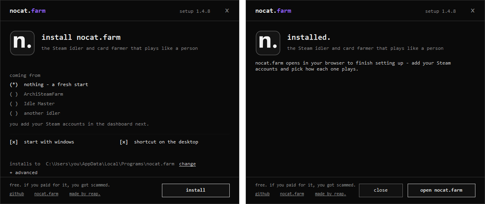
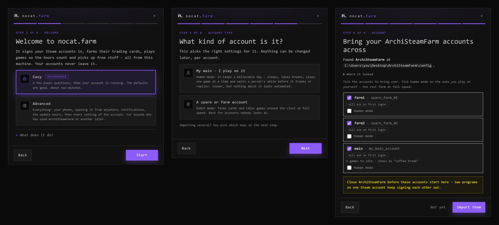
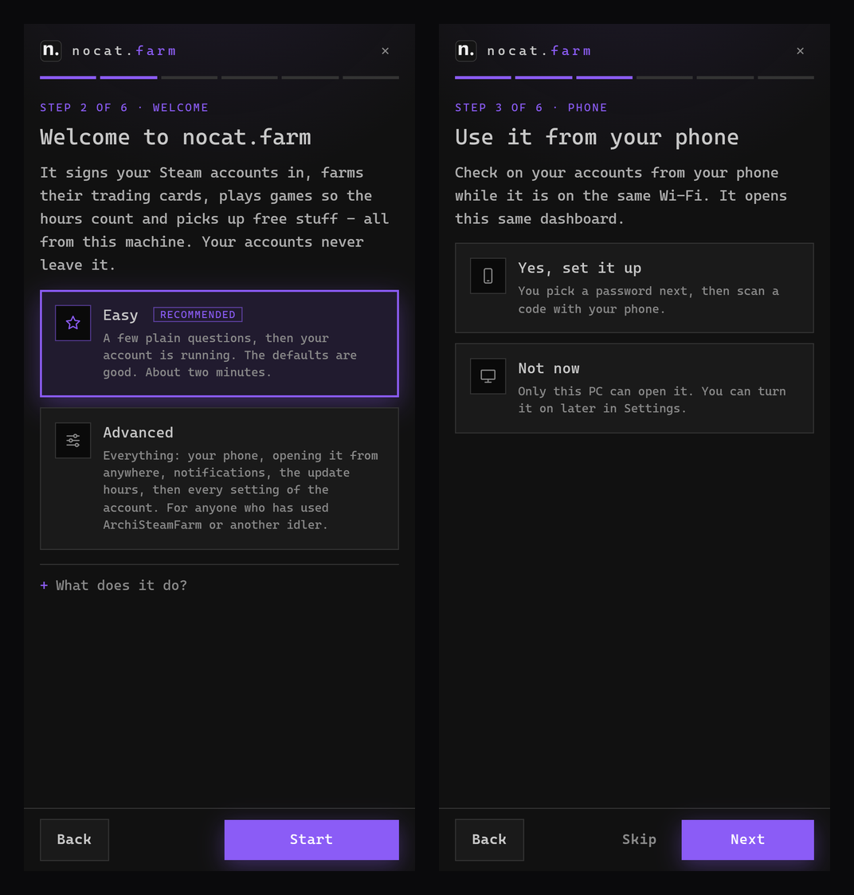
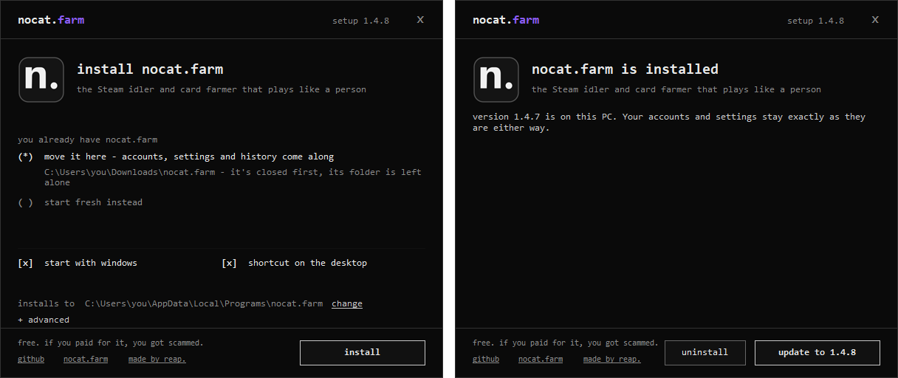
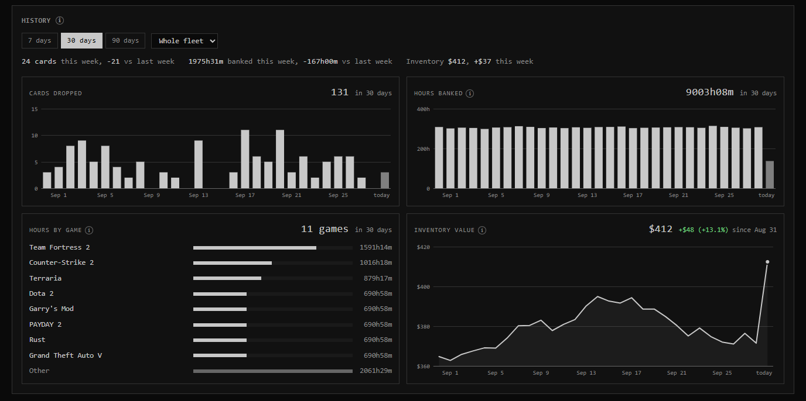
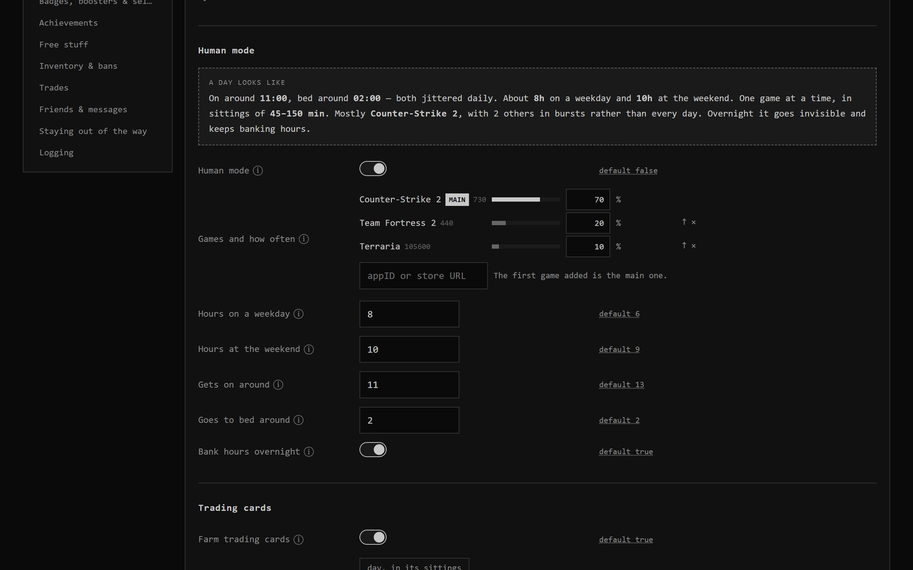
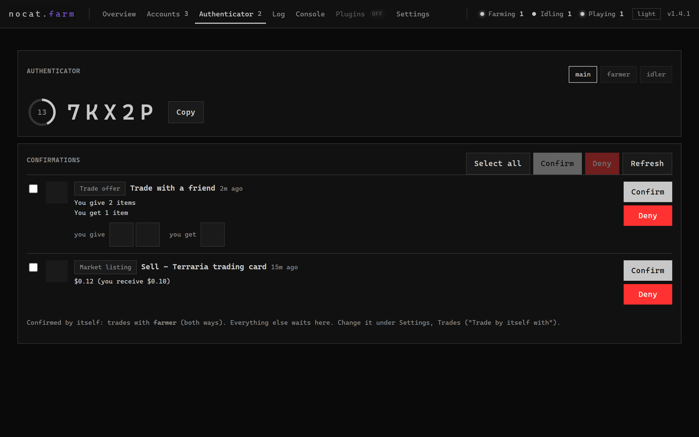
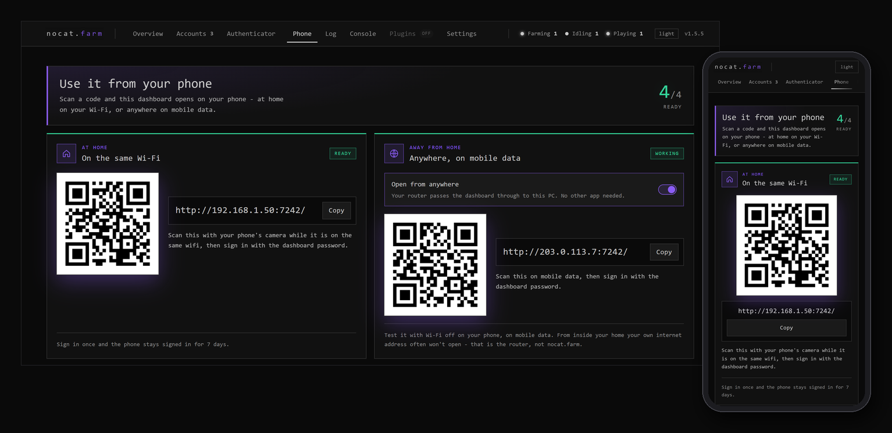
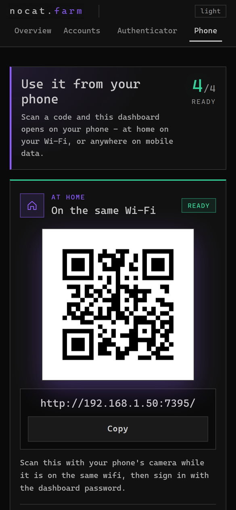

<p align="center">
  
</p>

<h1 align="center">nocat.farm</h1>

<p align="center">
  <b>Farms your Steam trading cards and idles your games on all your accounts, in the background -<br>
  and can make an account look like a real person is playing it.</b>
</p>

<p align="center">
  <a href="https://github.com/VisaHolder/nocatfarm/releases/latest"></a>
  
  
  
  
</p>

<p align="center">
  <a href="https://github.com/VisaHolder/nocatfarm/releases/latest"><b>Download</b></a> ·
  <a href="#what-it-does">What it does</a> ·
  <a href="#get-started-in-2-minutes">Install</a> ·
  <a href="#use-it-from-your-phone">Phone</a> ·
  <a href="#mini-mode">Mini mode</a> ·
  <a href="#the-commands-youll-actually-use">Commands</a> ·
  <a href="#is-it-safe">Is it safe?</a> ·
  <a href="#faq">FAQ</a> ·
  <a href="docs/COMMANDS.md">All commands</a> ·
  <a href="https://github.com/VisaHolder/nocatfarm/wiki">Wiki</a>
</p>

---

## What it does

nocat.farm signs your Steam accounts in and farms their trading cards, one game after another, with a rough
estimate of how long is left. When the cards are done it idles your games for playtime - up to 32 at once - and can
show a made-up game name on your profile (like `nocat.lol`) while the real games keep counting.

The account you actually play on can go in **human mode**. Then it plays one game at a time, takes breaks and
meals, goes to bed, and skips the odd day. When a game drops its last card it plays on for another 15-20 minutes
before a break, the way a normal session ends. Start a game yourself on any account and nocat.farm backs off, then
picks up again a few minutes after you stop.

Beyond that:

- Gifts, guest passes and sale stickers are picked up by default. Free-to-keep games and free DLC are one switch.
- Donations are accepted, items move between your own accounts, and fair one-for-one card swaps are taken if you
  turn that on. Any other offer is announced with a number (log, pop-up, Discord, Telegram) and waits for
  `trade accept myaccount 3` or `trade decline myaccount 3`.
- For accounts whose authenticator is in nocat.farm there's an Authenticator page: the Steam Guard code, and trades
  and market listings to confirm or deny, like the Steam app.
- A new VAC, game, trade or community ban is reported straight away, and that game's items are kept out of trades.
- History charts show cards per day, hours banked and inventory value, with this week against last.
- The Phone page gives you QR codes for your wifi and for away from home, and a checklist that fixes whatever
  isn't ready.
- Discord and Telegram can send you notifications and take commands. There's an optional *Playing nocat.farm*
  card for your Discord profile too.
- If you switch it on, achievements are earned one at a time in an order a real player could manage: "10 kills"
  after "5 kills", chapter 2 after chapter 1, Hard after Normal, the ending last. It paces them to how long the
  game really takes, so "finish the game" never lands 3 hours into a 20-hour game. An optional hunter picks games to
  earn them in.
- Smaller extras: selling spare cards, pricing your next Steam level, booster packs, crafting badges, product keys
  and rep4rep.
- It imports accounts and settings from ArchiSteamFarm, Idle Master Extended, Idle Master, HourBoostr,
  SingleBoostr, Steam Game Idler and steam-idler, and asks for each one whether you play on it or it's a spare.
- It updates itself when you click Update, or at night while your accounts sleep. A new version that won't start
  is put back automatically.

There's no sign-up, no server and no cloud. Your accounts never leave your PC, and every password, login token and
authenticator it keeps is encrypted.

## Get started in 2 minutes

<p align="center">
  
  <br><sub>The setup is one screen: where your accounts are coming from, start with Windows, a desktop shortcut.</sub>
</p>

1. Download from the [latest release](https://github.com/VisaHolder/nocatfarm/releases/latest). There are two
   Windows files:
   - `nocat.farm-v…-setup.exe` is the one most people want. It installs like any other app, with a Start menu
     entry, a desktop shortcut, start with Windows, and an uninstaller in *Settings → Apps*. No admin rights
     needed. If you already use ArchiSteamFarm, Idle Master or a portable nocat.farm, it finds it and offers to
     bring your accounts over.
   - `nocat.farm-v…-portable.zip` is the portable version. Right-click it, *Extract All…*, and run `nocatFarm.exe`.
     Nothing gets installed and everything stays in that folder.
2. The dashboard opens in your browser with a short walkthrough. Pick your language, then **Easy** (a few plain
   questions, about two minutes) or **Advanced** (your phone, opening it from anywhere, notifications, the update
   hours, then every setting of the account).
3. Say what the account is for. *My main - I play on it* turns on human mode. *A spare or farm account* farms at
   full speed. You can change this any time.
4. Add your Steam account. You type the password once, or in Advanced you can tick *Sign in with a QR code* and
   scan it with the Steam app instead. If the walkthrough finds another idler, it offers to bring those accounts
   across.

<p align="center">
  
  <br><sub>The walkthrough: Easy or Advanced, what the account is for, and your old idler's accounts if it found any.</sub>
</p>

<p align="center">
  
  <br><sub>The same walkthrough on a phone.</sub>
</p>

<p align="center">
  
  <br><sub>Run the setup again and it offers to move a portable copy into the install, or to update or uninstall.</sub>
</p>

It starts farming cards straight away. There's no .NET or anything else to install first, and both versions are
the same app that update themselves.

**Updating:** click **Update** on the dashboard or type `update accept`. Accounts, settings and logs are kept. Set
*When I say update* to *when my accounts are asleep* and it holds the install until nobody's playing, or set
*Update by itself* to install new versions at night with no click at all. `update now` always installs straight
away. On Linux and Docker you update by hand - see [Linux and Docker](https://github.com/VisaHolder/nocatfarm/wiki/Linux-Docker-and-VPS).

**Linux or a server?** There's a Linux zip for x64 and arm64 (Raspberry Pi), and a Dockerfile with an example
compose file. Both have been run on real x64 and arm64 machines, and Docker with real accounts. You get the
console and the web dashboard, no window. See [Linux and Docker](https://github.com/VisaHolder/nocatfarm/wiki/Linux-Docker-and-VPS).

## What it looks like

<p align="center">
  
  <br><sub>Each account: what it's doing, cards left, and exactly what your friends see. The dashboard lives at <code>http://127.0.0.1:7242/</code> and opens by itself.</sub>
</p>

<p align="center">
  
  <br><sub>History: cards, hours banked and inventory value, day by day.</sub>
</p>

<p align="center">
  
  <br><sub>Human mode: pick the games and the routine, and it tells you what a day will look like.</sub>
</p>

<p align="center">
  
  <br><sub>The Authenticator page: the code, and confirm or deny, for accounts whose authenticator is in nocat.farm.</sub>
</p>

<p align="center">
  
  <br><sub>Everything is also a command. Type <code>help</code> to see them all.</sub>
</p>

The dashboard, the app window's log and the setup all use Consolas. Phones and Linux don't have it, so the
dashboard brings its own copy of JetBrains Mono for them.

## Use it from your phone

The dashboard works on a phone, and the **Phone** tab is where you set that up. It shows two links as QR codes,
one for your home wifi and one for away from home, each with a Copy button. Under them is a checklist that ticks
itself off as things get fixed: a dashboard password, opening it to other devices, Windows Firewall, and your
router. Anything that isn't ready has its fix right beside it, including a button that restarts the dashboard
without signing your accounts out.

Away from home works like Jellyfin: your router forwards the port and nothing else needs installing. It needs a
password of at least 12 characters. If you'd rather not open anything, Telegram and Discord work from anywhere, and
their setup is on the same page.

<p align="center">
  
  &nbsp;
  
  <br><sub>The Phone page on a PC and on a phone (the addresses are examples).</sub>
</p>

## Mini mode

Click **mini** on the window (or type `mini`) and it shrinks to a small panel: every account, what it's doing, and
a start/stop button. A farming account opens up to show cards left, time left and a progress bar. The pin keeps it
above your other windows (off by default), and the arrow brings the full window back.

<p align="center">
  
  <br><sub>Left: one account farming, one playing, one idling. Right: a human-mode account farming its cards, one paused, one stopped, pinned on top.</sub>
</p>

## The commands you'll actually use

Type these in the app window or the dashboard's Console tab. You can also send them to an account in Steam chat;
the [wiki](docs/settings.md#commands-by-steam-chat) shows how.

| Command | What it does |
|---|---|
| `status` | What every account is doing right now. |
| `add myaccount mylogin human` | Add an account - `human` for your main (human mode), `robot` for a farm account. |
| `start myaccount` · `stop myaccount` | Sign an account in or out (`all` works too). |
| `pause myaccount 60` | Take a 60-minute break, then carry on by itself. |
| `cards` | Cards left to farm, and about how long it'll take. |
| `drops myaccount` | Go for card drops right now, then back to normal. |
| `play myaccount 730, 440` | Idle these games (the number is in the game's store link). Human-mode accounts pick their games under Settings → Human mode instead. |
| `name myaccount nocat.lol` | Show this name on your profile instead of the real game. |
| `human myaccount week` | See how human mode would spend the next week. |
| `value` | What each account's items are worth. |
| `match` | Swap spare cards between your own accounts so sets finish (`match do` sends them). |
| `sell myaccount` | Which spare cards it would sell, and what you'd get. |
| `levelup myaccount 50` | What reaching Steam level 50 would cost. |
| `offers` | Every trade offer that's waiting. |
| `dashboard` | The dashboard's address - on this PC, on your phone, and from anywhere if you've set that up. |
| `update accept` | Install the newest version (`update now` skips any waiting, `update skip` skips that version). |
| `help` | Every command. `help <anything>` explains one command or setting. |

[Every command](docs/COMMANDS.md) is in one list in the wiki. In the app, `help` shows the same list.

## Human mode

Turn it on for an account under **Settings → Human mode**, or with `set myaccount LegitMode true`. The account then
plays one game at a time in sittings of believable length, a main game with a few side games. It takes breaks and
meals, goes to bed at night, and now and then takes a day off. Trades, gifts and friend requests get answered after
a person's sort of delay, not two seconds later. Its cards farm inside that normal day. You can also give it hour
targets, like 100 hours of a game by a date you pick.

`selfcheck` scores a human-mode account out of 100 for how real it looks from the outside, and tells you which
setting fixes each problem. Accounts without human mode just farm and idle as hard as they can, which is fine for
spares.

## Is it safe?

Your accounts, login tokens and logs stay on your PC and are never uploaded. A password is only needed once: after
the first sign-in a Steam login token does the work, stored encrypted and tied to your Windows user (on Linux,
encrypted with a key only your user can read).

It talks to Steam, and to GitHub every 2 hours to see if there's a new version (you can change that or turn it
off). Discord, Telegram and rep4rep only come into it if you set them up, and *Open from anywhere* only talks to
your router if you turn it on.

It won't fight you for an account. Launch a game on one of its accounts and that account steps back. For an account
you also use in your own Steam app, turn on *I sign into this one myself* and it won't kick you off Friends & Chat.

The honest part: automating your accounts is against Steam's Subscriber Agreement and can get an account limited or
banned. nocat.farm is built to be gentle, but only run it on accounts you're OK with risking.

## FAQ

**Will I get banned?** People have used card idlers for years and bans for idling alone are rare. It is against
Steam's rules though, so there's always some risk. Human mode makes an account look a lot more normal.

**Can I still play on my account?** Yes. Start a game and that account backs off by itself, then picks back up a
few minutes after you stop.

**How many accounts can it run?** As many as you like. They sign in one after another so Steam doesn't mind.

**Can all my accounts join my Steam group?** Yes. Paste the group's link into **Groups every account joins**
(Settings → Global settings → All accounts). It starts with the nocat.farm group, and you can change or clear it.
Each account joins at its own random time, minutes apart, so they don't all turn up at once. `joingroup all <link>`
does it right now. Only open groups work; ones that need approval or an invite are skipped, and the log says why.

**Do I have to type my password every time?** No. Once, or never if you sign in with a QR code.

**I'm coming from another idler.** ArchiSteamFarm, Idle Master Extended, Idle Master, HourBoostr, SingleBoostr,
Steam Game Idler and steam-idler can all be brought over. Pick yours under *coming from* in the setup, let the
first-run walkthrough find it, or use **Import from another idler** on the Accounts page any time. It shows what it
found before writing anything, you pick human or robot for each account, and the other program's files are never
changed. From ASF the logins and authenticators come across too, so no passwords are needed. More in
[the wiki](docs/accounts.md#coming-from-another-idler).

**The settings page looks short.** That's on purpose. It shows the everyday switches; tick **Show advanced** for
timings, farming order, the dashboard's port and password, and the rest.

**It says Steam is rate-limiting it.** Steam slows down any PC that asks too much at once, usually after a lot of
restarts. nocat.farm waits it out by itself.

**Where are my settings?** In the `config` folder next to `nocatFarm.exe`. With the setup that's
`%LOCALAPPDATA%\Programs\nocat.farm\config`; with the portable zip it's wherever you unzipped it. Back that folder
up and you've backed up everything.

**How do I uninstall it?** Windows *Settings → Apps → nocat.farm → Uninstall*. It asks whether to keep your
accounts and settings. For the portable zip, close it and delete the folder.

**Can I run it on a VPS, so my PC doesn't have to stay on?** Yes. A small rented Linux server with 1 CPU and 1 GB
of memory is plenty. Install Docker, start it with the example compose file, and open the dashboard through an SSH
tunnel, or from anywhere behind a password (HTTPS with your own domain works too). The wiki goes through it step by
step, from renting the server to adding your accounts: [On a VPS](docs/linux-docker-vps.md#on-a-vps-a-rented-server).

**What if something breaks?** The dashboard's **Log** tab says what happened in plain words. If that doesn't help,
open an [issue](https://github.com/VisaHolder/nocatfarm/issues) and paste the log lines.

## More

- [The wiki](https://github.com/VisaHolder/nocatfarm/wiki) starts with a beginner's walkthrough, then covers every feature and setting.
- [Every command](docs/COMMANDS.md), in one list.
- [Write a plugin](PLUGINS.md) to add your own commands and features in a few lines of C#.
- To build it yourself you need the [.NET 10 SDK](https://dotnet.microsoft.com/download):

  ```
  git clone https://github.com/VisaHolder/nocatfarm.git
  cd nocatfarm
  dotnet publish src/NocatFarm -c Release -o run
  run\nocatFarm.exe
  ```

## Licence

[Mozilla Public License 2.0](LICENSE). Use it, fork it, sell it. Plugins can use any licence you like, even
closed-source. If you change nocat.farm's own files, share those changes and keep the copyright notice.

Built on [SteamKit2](https://github.com/SteamRE/SteamKit). Everything else is written from scratch for nocat.farm.
