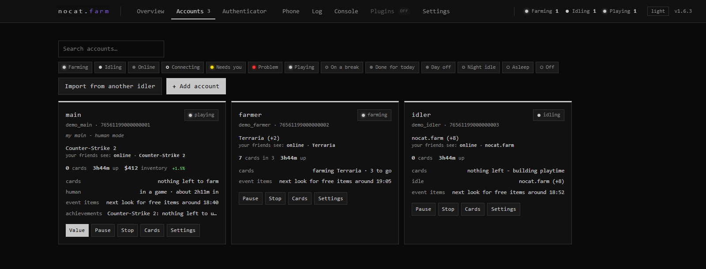
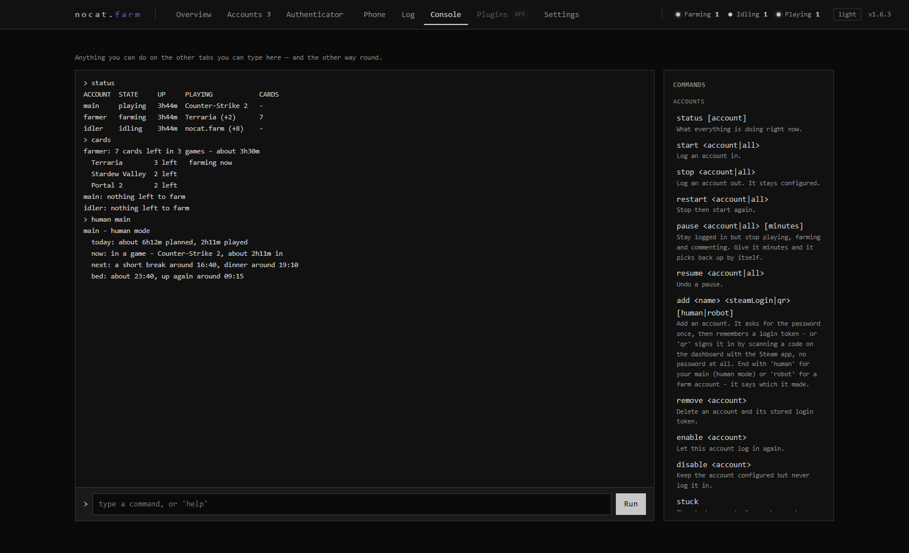
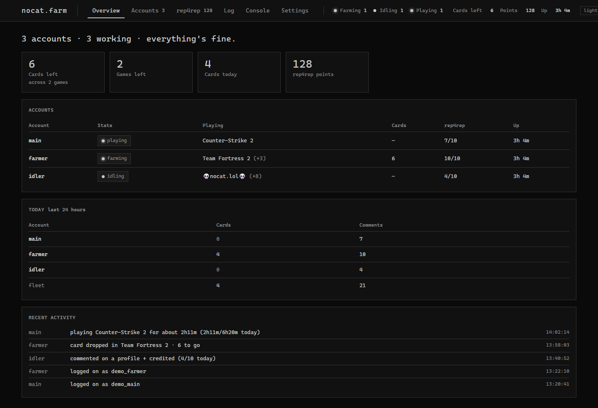

# nocat.farm - the full guide

Everything nocat.farm does, every command and setting, and how it works under the hood. New here? The
[front page](../README.md) is the short version - download, run, done.

**Contents** ·
[What it does](#what-it-does) · [Ways to drive it](#three-ways-to-drive-it) · [Getting started](#getting-started) ·
[Human mode](#human-mode) · [rep4rep](#rep4rep) · [Commands](#commands) · [Achievements](#achievements) ·
[The hunter](#the-hunter) · [Inventory value](#what-the-inventories-are-worth) ·
[Trades, keys & items](#trades-keys-and-items) · [Fair card swaps](#fair-card-swaps) · [Free stuff](#free-stuff) ·
[Plugins](#plugins) · [Settings](#settings) · [Command line](#command-line) · [Privacy & safety](#privacy-and-safety) ·
[How it works](#notes-on-how-it-works) · [Building it](#building-it)

---

## What it does

What an account does out of the box: it farms its trading cards, then idles the games you give it, collects free
event items, gift cards, guest passes and games friends gift it, accepts offers that ask for nothing, clears its Steam notifications and
joins the shared Steam groups (the nocat.farm group, until you change the list). Each of those has its own switch. Everything else below is optional and one
setting away.

| | |
|---|---|
| **Idling** | Plays any set of appIDs for playtime, and re-asserts them, so a network hiccup doesn't silently stop it. |
| **Custom game name** | Shows a non-Steam name (e.g. `nocat.lol`) on your profile and friends list **while the real games keep banking playtime**. Both at once. If Steam starts showing the real game instead, the account row warns "Steam shows …" and the name is put back. |
| **Device badge** | Friends can see the account playing on a phone, Big Picture, VR or a controller (`GameDevice`). |
| **Card farming** | On by default. Reads your own badge pages, bumps playtime on under-threshold games up to 32 at a time (31 with a custom name), then farms them solo. Drops are detected mainly from Steam's item-announcement **push**, with a periodic re-check as a backstop, so a finished game is noticed in seconds. It says roughly how long is left — Steam's usual 30 minutes a card at first, then this account's own pace, learned from the drops it times — in the log, the status and `cards`. |
| **rep4rep** | Optional. Posts the comments rep4rep assigns, on a human schedule, from every opted-in account — all into one points pool. |
| **Comment alerts** | Steam pushes the moment somebody comments on one of your profiles; it hits the log and a tray balloon. |
| **Tray pop-ups** | Three kinds, each with its own switch: earnings (cards, accepted trades, claimed games, event items, booster packs, activated keys, credited comments), social (friends, groups, comments) and problems (Steam Guard needed, failed logins, comment blocks, gifted games, banned games learned, updates). |
| **Stays out of your way** | Launch a game yourself on one of the accounts and that account stands down (`PauseWhenYouPlay`, on by default), then quietly picks back up after a delay you choose (`ResumeDelayMinutes`, default 5). |
| **Achievement hunter** | Optional (`AchievementBoost`, plus `UnlockAchievements`). Hunts a list you pick, or finds single-player games in the library itself — never DLC, demos or bundle filler nobody plays — and works through them one at a time. On a human account the sessions are occasional and weighted-first, coming out of the day's play budget; on a non-human account it moves from one game straight to the next. |
| **Inventory value** | What each account's items are worth at the market's median, per game (up to 12 inventories per account), in the currency you pick (`MarketCurrency`, default US dollar), with how it has moved in the last 24 hours. Reads the account's OWN inventory, so a private profile makes no difference. |
| **Free games** | Optional (`ClaimFreeGames`). Finds giveaways from Steam alone — **the store's own list of games at 100% off, and Steam's change feed** — and claims free-to-keep giveaways, packages and apps alike. Whatever it finds has to be a released, paid game showing 100% off, so free-to-play games, a paid game's free edition and demos are left alone. DLC marked down to free is taken too with `ClaimFreeDlc` (off by default) - Steam only gives a DLC to owners of its game, so when the game is missing it checks whether the game is free right now as well and, if so, claims the game first and then the DLC (`ClaimFreeDlcBase`, on); if the game costs money the DLC is skipped. The change feed usually sees a giveaway within half an hour of Steam publishing it. A giveaway that has already ended is tried a few more times, then left alone, and that is remembered across restarts. |
| **Free event items** | The daily sticker during a Steam sale, and anything in the Points Shop at 0 points, collected by themselves (`ClaimEventItems`, on by default). |
| **Gifts** | Steam wallet gift cards and guest passes sent to an account are accepted (`AcceptGifts`, on by default), and so are games friends gift it — added straight to the library (`AcceptGiftedGames`, on by default; turn it off to decide each one yourself). Each gift waits a person's time first (`GiftDelayMinMinutes` / `GiftDelayMaxMinutes`), and a gift is never declined. |
| **Booster packs** | Turns gems into booster packs for the games you list, one per game per day as Steam allows, on Steam's own schedule (`BoosterGames`). |
| **Fair card swaps** | Optional. Accepts the one-for-one card swaps card-swapping sites send, only when the swap can never set the account's sets back: every card given away must still have more copies afterwards than any card coming in had before (`AcceptFairCardSwaps`). |
| **Refund protection** | Optional (`SkipRefundableGames`, off by default). When on, a game bought in the last 14 days (`RefundHoldDays`) with under two hours played is left alone — by the card farmer, the idler, the schedule, grinds and the hunter alike — until it can no longer be refunded. Games friends gift the account count too (`ProtectGiftedGames`, on by default) — the giver can still get their money back. |
| **Steam Families** | Optional (`IncludeFamilyLibrary`, off by default). Games shared into the account can be hunted too, and are handed back as soon as anyone else in the family starts playing them (`YieldToFamily`, on by default). |
| **Plugins** | Optional and off by default. One DLL in `plugins/` extends the app: react to card drops and trade offers, read every account, run any command, add your own commands, and declare settings that get a real UI. See [PLUGINS.md](../PLUGINS.md). |
| **Daily report** | Once a day (default 09:30) it writes a one-look summary to the log: hours banked since the previous report, cards in the last 24h, rep4rep comments (when rep4rep is on) and a running total, per account plus a line for the whole fleet. `report` shows the same figures on demand. |
| **Eleven languages** | The dashboard's pages, labels and setting explanations — all 201 settings — are in Spanish, Portuguese (BR), Russian, German, French, Simplified Chinese, Turkish, Polish, Japanese and Korean, and so are account status lines and the log. Replies to typed commands stay in English. The walkthrough asks which language you want before it says anything else. |

<p align="center">
  
</p>

## Three ways to drive it

**App window** — the default on Windows. A small panel with a toolbar (start all · stop all · dashboard ·
accounts · commands), a live log, a status bar with today's cards and comments, and a command line where every
action is also a command. Type `help` to open the command sheet. `help <setting>` explains any setting: what it
does, its default and range, and whether it needs a restart. The accounts sheet lists every account with its own
start/stop, pause/resume, cards and profile buttons, plus *+ add account*. `--no-gui` (or `--console`) swaps the
window for a live console board with up-arrow history, which is also what you get on another OS.

**Mini mode** — the window's *mini* button (or `mini`, or the tray menu) shrinks it to a small panel: one line per
account with what it's doing and a start/stop button, and an account that's farming opens up to show its cards left,
about how long until it's done, and a progress bar. The title bar has the dashboard, a pin to keep it on top of other
windows (`MiniOnTop`, off by default) and the way back to the full window. It remembers where you put it, and opens
in mini next time if you left it that way.

<p align="center">
  
</p>

<p align="center">
  
</p>

**Tray** — right-click (or left-click) for Open dashboard · Hide/Show the window · Mini mode · Start all / Stop all accounts ·
Exit. The window's *hide* button, or closing it while the tray icon is there, sends it to the tray; in `--no-gui`
mode, minimising the console hides it (`MinimizeToTray`, on by default). `--minimized` boots straight to the tray
with no window at all, and *Start with Windows* wires that up for you.

**Dashboard** — `http://127.0.0.1:7242/`. Overview · Accounts · Log · Console · Plugins · Settings, plus a rep4rep
tab once you switch rep4rep on (`set Rep4RepEnabled true`, off by default). The Plugins tab is always there and
says "off" until you turn plugins on (`PluginsEnabled`, off by default). Keys `1`–`6` jump between tabs, `` ` ``
jumps to Console and Escape closes dialogs; `#settings` and the like open a tab by URL.

- **Accounts** — search by name, login, notes or game, click the status chips to filter, and drag cards into the
  order the app window and console board use too. Add accounts here (a welcome screen offers it when there are
  none); removing one asks you to type its name first.
- **Log** — live, with highlighted search, level chips (Debug hidden by default), a per-account filter, Follow and Copy.
- **Console** — the same commands with tab completion and up-arrow history saved in the browser. `help <setting>`
  (or `? <setting>`) explains a setting; `help <word>` that matches commands opens the filtered reference.
- **Overview** — replays the first-run walkthrough whenever you want it.

To use it from a phone or another PC, set `WebHost` to `0.0.0.0` and a `WebPassword`; the layout works on a
phone. Without a password it still refuses anything but this PC. Five wrong passwords lock an IP out for 60
minutes, a browser stays signed in for `WebSessionDays` (default 7), and a banner warns if the password is short
enough to guess. Turn the dashboard off with `set WebEnabled false` and restart, and nothing is lost.

<p align="center">
  
</p>

---

## Getting started

Type `tutorial`. It walks the six steps in order and ticks off the ones this machine has already done, so the
next thing to do is always the first unticked line. `tutorial cards`, `tutorial human`, `tutorial free`, `tutorial rep4rep`,
`tutorial trades`, `tutorial achievements` and `tutorial tray` go deeper on one thing each.

The dashboard has its own first-run setup, and it adds your first account at the end:

1. **Language** — before anything else is said.
2. **Quick setup or Full tour** — quick goes straight to the account; the full tour explains playing, free
   stuff, rep4rep and where the fine-tuning lives (*Show advanced*) on the way.
3. **What kind of account is it?** — *My main, I play on it* adds it in human mode (and, if you tick it, with
   *I sign into this one myself*); *A spare or farm account* keeps the full-speed defaults.
4. **Add it, or import from ArchiSteamFarm** — when an ASF install is found, every bot is listed with a tick
   box: the ones you tick come across in human mode, the rest as farm accounts.
5. **Sign in, right there** — the password, Steam Guard code or QR code are asked inside the setup window, not
   in a bar behind it. Only the Steam account name is needed; the nickname is optional.
6. **Set it up from its own games** — once it's signed in, a human-mode account's most-played games are shown to
   tap: its main game, a few side games, and a slider for how much of its time the main game gets. The full tour
   adds its daily routine (hours on a weekday and at the weekend, when it gets on, bedtime, chance of a day off)
   with a live one-line preview, or for a farm account which games to idle and an optional custom game name.
   *Skip - use the defaults* is always there. The last screen says what it's going to do now.

The Accounts page's own *+ add account* has the same *Human mode* tick. The setup shows once, on a machine with no
accounts; replay it from the Overview page.

The short version:

```
add myaccount steamlogin      # starts signing in straight away
play myaccount 730, 440       # idle CS2 and TF2
name myaccount nocat.lol      # show this instead of the real game
```

Card farming is already on, and cards come first: it works through everything with cards left, then falls back
to idling that list. `cards myaccount` shows what's outstanding.

The password is asked for **once per account**, then a Steam Guard code (approving the sign-in in the Steam
mobile app works too). Or skip the password entirely: tick *Sign in with a QR code* when adding the account (or
`add <name> qr`), and scan the code the dashboard shows with the Steam app — the account name comes from Steam, so
nothing is typed at all (`SignInWithQr`). The question shows up as a bar at the top of the dashboard and as a `?` prompt in the app
window — just type the answer; `answer <text>` does the same from anywhere. After that a Steam refresh token in
`config/tokens/` does the logging in — restarts are silent, no Guard code, no password. You never have to store a
password in a file. If a token is revoked (a password change, or "sign out everywhere") it is thrown away and the
password is asked for again, and after 3 failed sign-ins in a row an account stops trying, rather than risk the IP.
Steam's weekly Tuesday maintenance is recognised and waited out quietly.

Drop an account's `maFile` into `config/authenticators/`, named `<name>.maFile` after the name you gave it in
`add`, and it answers its own Steam Guard prompts. Or paste its secrets into the account's settings instead
(`SharedSecret` for Guard codes, `IdentitySecret` for trade confirmations — stored encrypted, and used ahead of a
maFile). With the identity secret, the offers it sends (`send`, `transfer`, `match`, fair swaps) confirm
themselves; without it, you confirm them on your phone.

Signing in on an account you also play on yourself? Turn on *I sign into this one myself* (`IUseThisAccount`).
It then never imposes Away, Snooze or Invisible and never re-sends its status while you're on, so your own
client keeps Friends & Chat.

**Coming from ArchiSteamFarm?** `import asf` brings every bot across *with its login token* — no passwords, no
Guard codes — plus its games, custom name, farming order, priority queue, blacklist and rep4rep settings. With no
path it looks in the usual ASF folders, and the dashboard offers the same import from a dialog (and a banner on
the welcome screen when it finds one). ASF's `FarmingPreferences`, `BotBehaviour`, `TradingPreferences` and
`SteamUserPermissions` are unpacked into the individual settings here, and `SendTradePeriod`, `AcceptGifts` and
the BoosterCreator plugin's `GamesToBooster` come across as their equivalents; HumanIdler plugin settings carry
over too. An authenticator comes across when ASF's folder still holds the bot's `<bot>.maFile`; one ASF has
already folded into its database needs its maFile dropped in by hand. Imported accounts are added but not
started.

## Human mode

The part that separates this from an idler. Turn it on per account (`LegitMode`, off by default) and it plays like
a person instead of a bot:

* weekdays and weekends have different shapes, and roughly one day in twenty it doesn't play at all
* one game at a time, in sittings of believable length, with a main game that takes most of the week (the one
  exception: the card farmer building playtime on games too new to drop runs them together)
* other games arrive in **bursts** rather than the same slice every single day — an even daily drip is the
  loudest pattern a farming account leaves
* short breaks, proper meal breaks around real meal times, and some of those spent appearing offline
* a settling-in gap after signing in, because nobody launches a game the second Steam opens. Underneath it is a
  hard safety gate no setting shortens: no game starts until at least 3 minutes after sign-in and several clear
  checks that you aren't playing on the account yourself — Steam takes a couple of minutes to report that — and
  the same checks run again after every reconnect
* offline overnight. It banks hours invisibly while it sleeps only if you list games under *Games to idle
  overnight* (`OfflineIdleGames`, empty by default)
* **cards come first, inside its day** — while cards are left, the card game is what it plays in its sittings,
  with the same warm-up, breaks, meals and bedtime, one game at a time; nights stay for the overnight games, and
  once the cards are done the day goes back to its usual games. When a game gives its last card it keeps playing
  it for another 15-20 minutes, then takes a break, and the next card game starts after that (*After the last
  card, keep playing* - `PostFarmWindDownMin`/`MaxMinutes`). A `drops` run at night stays invisible. *When to farm cards* (`FarmCardsWhen`) changes
  that: *only at night* holds cards until it's asleep and invisible and plays the usual games by day; *any time*
  farms the moment there are cards, day and night, straight through; *mixed* farms in only some of its sittings
  (`CardSittingsPct`, 40% by default) and plays its usual games in the rest, so cards drop in between them
* **grind fits it too** — `grind` on a legit account eases in (it keeps its current game for a minute or three
  before switching) and earns achievements at that account's normal pace when `UnlockAchievements` is on; on a
  boost account it just starts instantly
* **it answers like a person** — trade offers, gifts and friend requests each wait their own time before
  they're answered (`TradeDelay…`, `GiftDelay…` and `FriendRequestDelay…` — `Min`/`MaxMinutes` pairs). The wait
  mostly lands nearer the short end and now and then much later, never the flat, even spread a plain random pick
  gives. While the account sleeps they wait for morning, and each gets a fresh wait once it's up, so nothing
  fires the minute it wakes. Turn off *Only react while awake* (`ActOnlyWhileAwake`) and it answers at night
  too, after the same waits
* **only what people can see is held for its day** — trades, gifts, friend and group invites, replies,
  rep4rep comments and achievement unlocks wait until it's awake and settled in. Things nobody sees — crafting
  badges, free games, booster packs, event items, the discovery queue, selling cards, sends between your own
  accounts, joining the nocat.farm group, reading notifications — happen at any hour, just not the moment it
  signs in, each after its own random wait
* **every wait is a setting** (all under *Show advanced*, human-mode accounts only): *After waking, wait at
  least … up to* (`WakeDelayMin`/`MaxMinutes`, 10-90) for things people see; *After signing in, behind-the-scenes
  things wait at least … up to* (`QuietDelayMin`/`MaxMinutes`, 5-60); *Behind-the-scenes things wait for its day
  too* (`QuietThingsWaitForDay`, off) to hold those for its waking day as well; *On a break, go Away after at
  least … up to* (`BreakAwayAfterMin`/`MaxMinutes`, 2-10); and *Answer one trade offer at a time*
  (`OneTradeAtATime`, on) so a morning's worth of offers is answered a few minutes apart, not all at once
* stopping it doesn't blink the account out mid-game — it finishes up for a few seconds, then logs off

```
set myaccount LegitMode true
set myaccount GameWeights "730:70, 440:20, 550:10"    # first game is the main one
human myaccount week                                   # a freshly simulated sample week
human myaccount reroll                                 # apply changed hours/weights to TODAY
```

The first game's number is today's target share for the main game, rolled within about ten points of it each
morning. The side games share a time budget built from what's left, so the main game ends up at its number or a
little above it. That describes a **mixed** day, though, and `PureMainDayChancePct` (25 by default) is the share of
days that go on the main game alone — such a day can still open with one short sitting on something else. So each
side game is worth roughly its number times the days that aren't main-only: 20% written is about 15% of a real
week. Both the dashboard and `human` print the weekly figure next to the one you set, so you never have to work
that out.

A day is rolled once, at wake time, and then persisted so restarts don't hand out a fresh target every time —
which means changing the hours or the main game's share does nothing visible until tomorrow (the game list and
the side games' weights apply from the next sitting). `human <account> reroll` throws today's plan away and rolls
a new one from the settings as they stand.

**Hour targets** (`HourTargets`) get a game to a number of hours, optionally by a date, inside that ordinary
day — no booster running one game flat out. `730:100@2026-12-01, 440:50` means Counter-Strike 2 to 100 hours by
the end of the 1st of December, TF2 to 50 whenever. Cards still come first; after that each sitting may go to a
target game, harder the further behind schedule a dated target is (never every sitting). A dated target that day
play alone can't finish also joins the overnight games, but only if `OfflineIdleAtNight` is already on. Reaching
a target is logged once and the game stops being favoured. `hours <account>` shows each one: hours so far, what's
left, and the daily pace a date needs.

While it's on, the settings that would give an account away are hidden: the idle-games list is set aside (and put
back exactly as it was if you turn human mode off), and farming while appearing offline is ignored.

## rep4rep

rep4rep is a third-party site where users trade profile comments. It's **entirely optional and off by
default** — the dashboard hides its tab, its points and its per-account options until you switch it on under
**Settings → rep4rep account → "Use rep4rep at all"** (`Rep4RepEnabled`). Most people won't want it; leave it off
and no commenting ever runs.

If you do want it: turn it on, open the **rep4rep** tab and paste your API token (from rep4rep.com → Settings).
It's validated before it's saved, so a typo can't silently stop every account commenting. Then switch it on per
account — or use the tab's *Turn it on for all* button. Each Steam account is registered with your rep4rep
account the first time it's needed (`Rep4RepAutoAddProfiles`, on by default), and the tab has a per-account
*Register* button if that ever fails.

Steam's ceiling for comments on people who aren't your friends is about **10 per rolling 24 hours, per
account**. A per-account cap enforces it — *Most per 24 hours* (`Rep4RepDailyCap`, default 10, 1–25) — and the
count is **persisted**, so a restart can't reset it, which is the mistake that actually gets accounts
comment-banned. If Steam refuses an account below the cap you set, it learns that account's real limit and uses
it from then on, shown as "(Steam's)" (`Rep4RepLearnCap`, on by default); an ordinary "too frequently" refusal
never lowers it. If an account's state file can't be read, that account doesn't comment until it can: fail safe,
not fail open.

The pacing, all per account (the rep4rep tab has an editable grid for the cap, gaps and hours):

* a commenting window (default 10:00–23:00), staggered per account per day
* 10–25 minutes between one account's comments, jittered
* a refused post gets **one** retry, then that *profile* is marked a dud and skipped for 26h, and a different one
  is tried
* three different dud profiles in a row bench the *account* for 24h, while the other accounts carry on. A refusal
  Steam words as an account restriction, or Steam's own daily-limit message, rests the account for about 24h
  straight away
* an unknown outcome is counted and never retried (Steam may have posted it; a retry would double-comment)
* after two rate-limit refusals in a row it stops chasing and rests until 24h after the account's last post,
  then starts fresh — rather than retrying into the same wall all day
* `rep4rep rest <account|all>` forces exactly that: a full day off, then back at a clean baseline

**Taking a few days off.** *Settings → rep4rep account → "Hold commenting for (hours)"* (`Rep4RepPauseHours`)
stops all scheduled commenting for that many hours and then carries on by itself. 24 is a day, 48 is two, and
anything in between works — a 27-hour pause is just 27. The countdown is anchored to when you set it, so it
survives restarts and saving other settings doesn't push it back. When it runs out each account comes back with
its rolling 24h count wiped, its strikes, blocks and skipped profiles cleared, and the setting puts itself back to
0 — so keep holds to 24 hours or more, or a short one can let an account go past Steam's ~10 a day. Nothing else
is touched. A task you post by hand with the tab's *Post now* still goes out during a hold, up to the daily cap.

> **Every task is worth the same.** rep4rep's API returns a task id, the comment text, its template id and the
> profile it's for — there is no value or credit field to sort or filter on, so there's nothing to pick between
> and no setting here pretends otherwise.

Points appear as **pending** first — that's rep4rep verifying the comment really landed, usually within a few
hours. Nothing is lost. The tab shows both, with a *Refresh* button.

Removing a profile, editing your comment list, task history, buying points and referrals have no API. The
dashboard links out to rep4rep.com for those rather than pretending.

---

## Commands

`help` lists every built-in command (plugin commands are listed by `plugins`); `help <command>` or
`help <setting>` explains one. The dashboard's Console tab runs the same commands with the same output — there a
bare `help` opens a searchable reference. Commands shown with `<account|all>` also take `all`.

You can also drive an account by **Steam chat**: message it from a master (a SteamID64 in that account's
`CommandMasters`), prefixed with `/` or `!` — e.g. `/help`, `!status new`. A plain message with no prefix gets
the auto-reply instead, so ordinary chat is never mistaken for a command. Bare verbs such as `/pause` or
`/status` act on the account that received the message, prefixed commands from anyone who isn't a master are
ignored, and replies are cut at 1,900 characters.

<details>
<summary><b>Every command</b> — click to expand</summary>

<br>

**Accounts**

| Command | What it does |
|---|---|
| `status [account]` &nbsp;·&nbsp; `s` `bots` | What everything is doing right now. |
| `start <account\|all>` | Log an account in. |
| `stop <account\|all>` | Log an account out (stays configured). A human-mode account finishes up for a few seconds first. |
| `restart <account\|all>` | Stop then start again. |
| `pause <account\|all> [minutes]` | Stay logged in but stop playing, farming and commenting. Give it minutes and it picks back up by itself. |
| `resume <account\|all>` | Undo a pause. |
| `add <name> <steamLogin\|qr>` | Add an account. Asks for the password once, then remembers a login token — or `qr` shows a code on the dashboard to scan with the Steam app, no password at all. |
| `remove <account>` &nbsp;·&nbsp; `delete` | Delete an account and its stored login token. |
| `enable <account>` | Let this account log in again. |
| `disable <account>` | Keep it configured but never log it in. |
| `redeem [account] <key…\|file.txt>` &nbsp;·&nbsp; `key` | Activate product keys, or point it at a text file full of them. More than five queues itself. |
| `keys [list\|clear]` | Product keys still waiting to be activated. |
| `2fa <account>` &nbsp;·&nbsp; `guard` | Show this account's Steam Guard code, if its authenticator is set up here. |
| `level [account\|all]` | Each account's Steam level. |
| `balance [account\|all]` &nbsp;·&nbsp; `wallet` | Steam wallet balance, and anything still pending. |
| `points [account\|all]` | Steam points each account can spend in the Points Shop. |
| `privacy <account> [public\|friends\|private\|part=level …]` | See the profile privacy, or set it: one word for everything, or parts such as `inventory=public comments=friends`. |
| `selfcheck [account]` &nbsp;·&nbsp; `tells` | Does it look like a bot? A score out of 100 from what other people can actually see — hours in the past two weeks on the profile, games running at once, the non-Steam name in its status, no human rhythm, rep4rep comments, a long tail of 1-5 hour games — each tell with the setting that fixes it. Hour tells count less when game details are friends-only or private. Only human-mode accounts are checked; a boost account is a robot on purpose, so it's scored only when you name it, and without the "fix" advice. |

**Playing**

| Command | What it does |
|---|---|
| `play <account> <appIDs\|none>` | Set the games this account idles for playtime (multiple allowed). |
| `grind <account\|all> <appID> <hours>` &nbsp;·&nbsp; `grind <account> off` | Play one game hard for N hours, then back to normal. With `UnlockAchievements` on it earns achievements while it runs. On a human-mode account it eases in and out; on any other account it starts instantly. |
| `human [account] [week\|reroll]` | What human mode is doing today; add `week` for the next seven days, or `reroll` to throw today's plan away and roll a fresh one from the current settings. |
| `hours <account>` | How its hour targets are going — hours so far, what's left, and the daily pace needed to make a date. |
| `owns <appID\|name>` | Which accounts already own a game, and how long each has played it. Takes an appID, a store URL, or part of a name. Steam's owned-games list quietly leaves some played games out (TF2 picked up after it went free, for one), so the library also reads the play history the Steam client uses and adds any game the account holds its own licence for. |
| `addlicense <account\|all> <IDs>` | Add free licences to a library: a subID, or `a/<appID>` for a free app. Steam refuses anything that isn't actually free, and the answer says why. |
| `wake <account>` &nbsp;·&nbsp; `wakeup` `skipsleep` | Wake a sleeping human-mode account and start its day now. Bed time is unchanged. |
| `name <account> [text\|off]` | Custom non-Steam game name shown instead of the real game. No text shows the current one; `off` clears it. |
| `nickname <account> <profile name>` | Change the name everybody sees on the profile and friends list. |
| `joingroup <account\|all> <group link or name>` | Join a Steam group now, if it's open. Says so when a group needs approval, is invite only, or doesn't exist. |
| `persona <account> <state>` | online \| offline \| busy \| away \| snooze \| invisible. |
| `cheevo <account> <appID> [list\|unlock\|lock] [name\|all]` &nbsp;·&nbsp; `ach` | Achievements: see them, unlock them, or put them back. |
| `hunt [account]` &nbsp;·&nbsp; `boost` | What the achievement hunter would play next, in order - and what it ruled out, with the reason for each. |

**Trading cards**

| Command | What it does |
|---|---|
| `cards [account]` | What is still left to farm, and about how long it will take. |
| `drops <account> [appID\|next] [count\|all]` &nbsp;·&nbsp; `drops <account> off` | Go for card drops now, whatever the schedule says: one game until it has dropped that many (all it has left by default), then back to the usual day — like `grind`, but it stops when the drops are in. Without an appID, the next game with cards. It gives up on its own if the drops stop coming (twice the expected time). |
| `farm <account> on\|off` | Turn trading-card farming on or off. |
| `sell <account> [preview\|do\|relist] [count]` | Spare trading cards on the market. `preview` (the default) shows what it would list: a cent under the cheapest listing, with Steam's 5% + 10% fees worked out so "you get" is what you get. `do` lists them (5 by default, 20-60 s apart) and confirms them on the account's authenticator if its secrets are loaded - otherwise confirm in the Steam app. `relist` takes down week-old listings the market has gone under. Spare = with a game's whole set, as many copies as badge levels it can still craft; with part of a set, one of each; badge maxed, none. Foils are never sold. `SellDuplicates` does it by itself every 8-14 hours while awake. |
| `queue [account\|all]` | Go through today's discovery queue now, 6-25 s on each game. `DiscoveryQueue` does it by itself once a Steam day - during sales by default, when it earns the event's items and badge progress. |
| `levelup <account> <level>` &nbsp;·&nbsp; `lvlup` | What reaching a Steam level would cost: the XP missing, badge levels it can craft from its own cards, sets it has nearly finished, and the cheapest complete sets on the market for the rest (up to five levels per game). Priced in the background a few seconds per request and cached for a day, so run it, wait for "level plan … is ready" in the log, and run it again. |
| `match [do]` | Swap duplicate trading cards between your own accounts so sets finish - only swaps that help both accounts, never a card that's already on an offer. `match do` sends the offers, and the other account checks each one and accepts it by itself. Each account swaps with one other per run - run it again once those have gone through. |
| `offers [account\|all]` | Every live trade offer, straight from Steam: waiting, sent, stuck on a phone confirmation or in a trade hold. |
| `value [account\|all] [refresh]` &nbsp;·&nbsp; `inv` `inventory` | What each inventory is worth at the market's median, by game, with how it has moved in the last 24 hours. `refresh` reads the inventories again. |
| `send <account\|all>` &nbsp;·&nbsp; `loot` | Send an account's items — trading cards by default, or whatever its `SendItemTypes` allows — to the first of your own accounts listed under Trades. |
| `booster [account\|all]` &nbsp;·&nbsp; `booster <account> <appIDs>` | Gems, and which games can be made into booster packs; with appIDs, make those packs now. |
| `freeitems [account\|all]` | Look for the daily sale sticker and 0-point Points Shop items now. |
| `fairswap <account> <offerID>` | Whether a trade offer is a fair card swap, and why not if it isn't. Only looks. |
| `transfer <from> <to> [types]` | Send items from one of your accounts to another: cards, foils, backgrounds, emoticons, boosters, gems or all. Trading cards if left off. |

**rep4rep** &nbsp;(alias `r4r`; run bare for a summary)

| Command | What it does |
|---|---|
| `rep4rep status` | Per-account count, cap, last post and current state. |
| `rep4rep points` | Points you can spend, and points still being verified. |
| `rep4rep profiles` | The Steam profiles registered with rep4rep. |
| `rep4rep tasks <account>` | The comment tasks waiting for one account. |
| `rep4rep on\|off <account\|all>` | Turn commenting on or off. |
| `rep4rep now <account\|all>` | Post now, skipping the wait (never the daily cap). |
| `rep4rep pause\|resume <account\|all>` | Hold commenting, or let it go again. |
| `rep4rep clear <account\|all>` | Release a 24h block early. |
| `rep4rep rest <account\|all>` | Pause a full 24h and come back at a clean baseline. |

**Settings & data**

| Command | What it does |
|---|---|
| `config [account] [all]` | Show the settings and their current values; the advanced ones only with `all`. |
| `set [account] <key> <value>` | Change a setting; without an account name it changes a global one. |
| `import asf [path] [force]` | Bring accounts across from ArchiSteamFarm, login tokens and all. |
| `reload` | Re-read every config file from disk. |

**Everything else**

| Command | What it does |
|---|---|
| `log [count]` &nbsp;·&nbsp; `logs` | The last few log lines. |
| `stats [hours]` | Cards dropped and comments posted, by hour. |
| `report` | Write the daily summary to the log now. |
| `answer <text>` | Answer whatever nocat.farm is waiting on — a Steam Guard code, or a password. |
| `tutorial [topic]` &nbsp;·&nbsp; `guide` `setup` | Getting started, in order, ticking off what's done. |
| `help [command\|setting]` &nbsp;·&nbsp; `?` `h` | This list, or what one command or setting does. |
| `theme [dark\|light]` | Switch the dashboard theme. |
| `version` &nbsp;·&nbsp; `about` | Which version this is. |
| `mini [on\|off]` | Shrink the window to a small panel of your accounts, or back to the full window. |
| `update [accept\|ignore]` | Check for a newer release (it also checks by itself every few hours, `CheckForUpdates`, and while one is out it reminds you hourly, `UpdateReminders`). `update accept` downloads it and restarts into it; `update ignore` stops the reminders until the next launch — nothing ever installs on its own. |
| `plugins` | Which plugins are loaded, and where they came from. |
| `exit` &nbsp;·&nbsp; `quit` `q` | Shut nocat.farm down (local only — never over Steam chat). |

</details>

## Achievements

```
cheevo myaccount 440                  # what it has, easiest first, with how rare each one is
cheevo myaccount 440 unlock all       # every one the client is allowed to set, now
cheevo myaccount 440 unlock ACH_NAME  # just one
cheevo myaccount 440 lock ACH_NAME    # put one back
```

Unlocking a whole list at once is permanent, stamped with one shared timestamp, and visible on the profile
forever — so for an account meant to look real there's a drip instead: `set myaccount UnlockAchievements true`
(off by default) earns them **easiest first** (the ones most owners have are the ones you get by simply playing),
only in a game the account actually has open. Each game is paced on its own — roughly one per hour of real play,
a little faster in a game's opening cluster and sometimes two or three together — and *How fast*
(`AchievementPace`: careful, normal, brisk) doubles or halves the gaps. Pace only stretches the waiting; it never
opens the rarity gate early.

Four rules keep the result believable, and all four are things a profile would otherwise give away:

* **It stops short.** `AchievementMaxCompletionPct` (90 by default) is the most of any one game that will ever
  be completed. One figure, yours, applied to every game the same way — a game sitting at exactly 100% on an
  account that idles is what somebody notices. The one exception is a game's opening cluster (usually 3, up to
  10 for some games), which is always allowed, so a very small game can go past the figure. A deliberate `grind`
  ignores the cap; that's the explicit finish-it path.
* **Rarity opens with the hours.** An achievement 3% of owners have isn't eligible two hours in. Nothing is
  eligible for the first half hour; then the floor starts at "40%+ only" and steps down as the playtime builds
  (scaled per game), bottoming at 1% — never 0%, because a sub-1% achievement on an idled account is the actual
  tell. It reads Steam's own total for the game, not just the hours this tool put on it, so a library you already
  played counts.
* **Milestones wait for what they're milestones of.** `TF_SNIPER_ACHIEVE_PROGRESS2` is granted for holding
  eleven other `TF_SNIPER_*` achievements. Nothing in its display name says so, and "Sniper Milestone 2" on a
  profile showing three Sniper achievements isn't rare, it's impossible. Tiers are held until their group is
  earned, and a numbered ladder is always climbed in order.
* **It clusters.** Real unlocks come two or three together and then nothing for a day, so bursts are modelled
  rather than a steady one-every-N-minutes metronome.

`AchievementNeverGames` keeps the drip and the hunter out of those games (a manual `cheevo` still works there),
and `AchievementIncludeMainGame` (on) decides whether human mode's main game earns like any other — it's where
the hours are, so leaving it out is usually the stranger of the two.

`grind` earns them too, on whatever game you point it at, when `UnlockAchievements` is on — on any account, at
the grind's own shorter spacing, and never in a game on the never-list or outside the allow-list. The catch is
that **some games' achievements are set by Steam's servers, not the client — Counter-Strike 2 is the classic
case — and nothing can unlock those**; the log says so for such a game. `cheevo … unlock all` skips them too.

For a library you really do want finished, each account's advanced settings have a *Careful* box that unlocks
every settable achievement in every game it owns. You have to type `confirm`, the account has to be signed in,
and it is permanent — there is deliberately no command for it.

### The hunter

`UnlockAchievements` decides *how* achievements come out of games the account was going to play anyway. It never
starts a game. The **achievement hunter** is the other half: it decides *which games get played at all*, so there
is something to earn in. It needs both switches:

```
set myaccount UnlockAchievements true
set myaccount AchievementBoost 2      # 0 off (default) · 1 games you pick · 2 every single-player game it owns
```

Mode 2 works the library out for itself. A game has to be a **game** (never DLC, a demo, a soundtrack or a
tool), be single-player, have achievements, and have enough Steam reviews that a person might plausibly own it —
which is what keeps bundle filler out. Blacklists, the never-list and the achievement allow-list are stripped out
on top, and so is anything inside its refund window when refund protection (`SkipRefundableGames`) is on. Games
shared through Steam Families only count with `IncludeFamilyLibrary` on (off by default).

One game at a time, about two hours each (`BoostSessionHours`), then it rotates to the next. On a **human**
account it stays weighted-first: a session, then a long stretch of the normal schedule (`BoostRestMinutesHuman`),
capped at `MaxBoostGamesInARow` before a longer one. It never *starts* a session while the account is asleep
(with *Only react while awake* on, the default — a session already running isn't cut at bedtime), never while
cards are being farmed, never over a grind you started, and it won't start a new one once the day's play target
is met. On a non-human account it moves from one game straight to the next. `hunt` prints exactly what it would
play next and why everything else was ruled out.

Without it, the only automatic way to earn across a library on a human-mode account is to put every
single-player game into `GameWeights` — which destroys the thing human mode exists for, because a weighted
schedule is supposed to look like one game somebody mains and a couple they dip into, not two hundred at equal
weight.

## What the inventories are worth

```
value                    # every account, by game, and how it moved in the last 24h
value myaccount refresh  # read that account's inventory again (prices stay cached)
```

Priced at the community market's **median**, in whatever currency the global `MarketCurrency` is set to. Match
it to your Steam store or the totals won't agree with what you see on the market. Items count whatever their trade
status, because a trade hold doesn't make a knife worthless. Only the first 12 inventory contexts on the account
are read, though, in the order Steam lists them, so an account holding items in more games than that leaves some
out of the total. Inventories are re-read every 6 hours. Prices are shared between accounts and re-checked
according to what they're worth: anything worth 2 or more as often as `PriceCacheHours` says (24 by default),
cheaper items less often, and items with no market listing once a week. They're looked up slowly, about one every
`MarketGapSeconds` (10 by default) in one queue shared by every account, because everything the app does on
steamcommunity.com shares one rate limit. The first valuation of a big inventory can take several hours to
settle. After that, cached prices make the total show up straight away.

Accounts that hold nothing worth pricing can have `ShowInventoryValue` turned off (on by default). That account
is skipped entirely, with no market lookups and no value on the dashboard.

Games the account is **banned** in go in `InventoryIgnoreGames`. Their items are listed as skipped and left out
of the total. Steam doesn't publish which game a ban is in and nothing in the inventory reliably shows it, so you
can fill the list in yourself. Sending items also learns it. Steam refuses a whole offer if one game in it is
banned, so when an offer is refused that way it's sent again one game at a time. A game refused while the others
go through is added to the list, and the cards still arrive. If every game is refused the problem is the trade
itself, and nothing is added.

## Trades, keys and items

```
set myaccount TradeMasters 7656119...   # accounts you own
set myaccount AcceptFromMasters true    # let those take items
send myaccount                          # sweep its cards to the first master
set myaccount SendEveryHours 24         # ...or do it by itself once a day
set myaccount AcceptDonations false     # donations are accepted by default - this turns that off
redeem AAAAA-BBBBB-CCCCC                # tries each account until one can use the key
2fa myaccount                           # its current Steam Guard code
```

A donation is an offer where you give up nothing at all, so accepting one can never cost the account anything —
which is why `AcceptDonations` is on by default. An offer asking for even one of your items is not a donation and
is never accepted on that rule: only accounts on your own masters list (with `AcceptFromMasters` on) can take
anything, apart from one-for-one fair card swaps. Offers are read straight from Steam's trade-offer API with the
account's own login, so there's no Steam Web API key to set up - and an offer Steam can't fully describe is never
taken for a donation. Each one waits its own time before it's accepted or declined — 2–15 minutes by default, most often
nearer 2 (`TradeDelayMinMinutes` / `TradeDelayMaxMinutes`) — and on a human-mode account it waits for morning while
the account sleeps, then gets a fresh wait once it's up. An offer you accept or cancel yourself in Steam simply
drops off the list.

What may leave an account is `SendItemTypes` (*What to send*: cards, foils, backgrounds, emoticons, boosters, gems,
or `all`) — trading cards by default. `all` means everything tradable in every game inventory the account has,
CS2 skins included, not just Steam community items. `send` goes to the first account under `TradeMasters`;
`transfer <from> <to> [types]` moves items between any two of your accounts; `SendOnFarmingFinished` sends once
when farming runs out of cards (after a few minutes for the last drop to land). Between accounts that aren't
Steam friends, Steam wants the recipient's trade-link token — read automatically when the recipient is one of your
own signed-in accounts, or set `TradeMasterToken`.

`SendEveryHours` is `send` on a timer, so cards don't pile up between farming runs. The first send is one full
period after you switch it on, a little random slack keeps it off the same minute every time, and on a
human-mode account it waits until the account is awake.

Offers the account sends confirm themselves when its authenticator's identity secret is here (a maFile, or
`IdentitySecret` in its settings); otherwise they wait for you to confirm them on your phone.

### Fair card swaps

```
set myaccount AcceptFairCardSwaps true   # accept one-for-one swaps that never hurt your sets
fairswap myaccount 7812345678           # is this offer a fair card swap - and if not, why not
```

This is what Steam Trade Matcher users send all day: your duplicate of one card for their copy of another, same
game, one for one. With `AcceptFairCardSwaps` on, an offer like that is accepted from anyone, but only when:

* every item on both sides is an ordinary trading card — no foils, backgrounds, emoticons or anything else
* each game gets back exactly as many cards as it gives
* the swap never sets the account's sets back. Three of card A and none of card B becoming two and one is fine,
  and so is a swap that changes nothing either way; giving away the last copy of a card to get a third of another
  is not

An offer with a different number of items on each side is passed over without being
read, so it leaves no line in the log. An offer with matching counts that fails the test is left alone with the
reason in the log, once. Either way it is declined instead if `DeclineOtherTrades` is on. `fairswap` runs the same
test on any offer and only looks — it answers whether or not `AcceptFairCardSwaps` is on, and never accepts or
declines.

The set test is our own, and simple enough to check by hand: per game, every card given away must still have MORE
copies afterwards than any card coming in had before. Copies only move from a bigger pile to a smaller one, so no
card can run out, the number of different cards never shrinks and complete sets never go down. It's exactly one for
one per game — an offer with extra cards thrown in is not accepted — and a swap that would sit in a trade hold is
left alone. It's off by default because it gives cards away. With the account's mobile authenticator here the swap is
confirmed by itself; without it, it waits for you on your phone, and the status says so.

Swaps between your **own** accounts (the ones `match` sends) are always judged this way and accepted by themselves,
even with `AcceptFairCardSwaps` off. Every swap is judged again at the moment it's accepted, one at a time, and cards
already promised to an offer waiting on a phone confirmation count as gone - so two offers can never spend the same
card.

## Free stuff

```
set myaccount ClaimFreeGames true      # paid games given away free-to-keep (off by default)
set myaccount ClaimEventItems true     # sale stickers and 0-point Points Shop items (on by default)
set myaccount AcceptGifts true         # wallet gift cards and guest passes (on by default)
set myaccount BoosterGames "730, 440"  # turn gems into booster packs for these games
booster myaccount                      # gems, and which games can be made into packs
freeitems all                          # look for free event items now
```

**Free games** come from Steam itself, two ways. A giveaway is a paid game on a 100% discount, and the store's own
search lists exactly those — it's read about once an hour, once for every account — and Steam's own change feed is
read about every half hour — every package Steam edits shows up there within seconds, and a
paid game being given away is a package edit. Either way, the store is asked before anything is taken, and the
game has to be a released, paid game showing 100% off. That leaves out free-to-play games, DLC, demos,
unreleased titles, and the permanently free editions some paid games have (a "Free Starter Edition" is free, but
the game itself isn't being given away). When the store doesn't answer, nothing is decided and it's looked at
again on the next pass. A game only borrowed through Steam Family doesn't count as owned, so a giveaway of it is
claimed for real. Steam allows about 30 activations per 90 minutes, so this stops at 20 to leave room for
anything you redeem yourself; if Steam says slow down it waits the hour out, and what it has already decided is
kept across restarts.

**Event items.** During a Steam sale there is a free sticker to claim every day, and it's claimed shortly after
the next one opens. The Points Shop has no "free" list of its own, so every item in it is read — once for all
accounts, since the shop is the same for everyone — and anything at 0 points is taken, remembering what each
account already has.

**Discovery queue.** During a Steam sale, going through the store's discovery queue each day earns the sale's
event items and badge progress. With `DiscoveryQueue` on its default (*during sales*) each account does it once a
Steam day while it's awake, a few seconds on each game like a person clicking *Next*; *every day* does it all year,
and `queue` does it now.

**Gifts.** Steam wallet gift cards and guest passes somebody sends are accepted. Steam pushes the number of
waiting gifts over the connection, so the gifts page is only read when there's something on it. Games friends gift the account are added to its library, the same as pressing *Add to my library* (`AcceptGiftedGames`, on by default).
Each gift waits its own time before it's taken — 2–15 minutes by default, most often nearer 2 (`GiftDelayMinMinutes` /
`GiftDelayMaxMinutes`) — and if you take it yourself in the meantime, the app just finds nothing left to do.
Nothing here ever declines a gift — turn the setting off and each one waits for you to take or turn down yourself
(turning one down refunds the sender).

**Booster packs.** Steam lets an account make one booster pack per game a day, for gems, for the games its
booster creator page lists — `booster` shows which. List the games in `BoosterGames` and each pack is made as
soon as Steam allows, using tradable gems first so the pack is tradable too. `UnpackBoosterPacks` opens every
pack in the inventory, and `CraftBadges` turns finished sets into badges; both run in one pass about once a day,
either works without the other, and both are off by default.

On a human-mode account, gifts wait until it's awake while `ActOnlyWhileAwake` is on (it is by default), and get
a fresh wait once it's up — accepting at 4am on an account that's asleep on the friends list is a tell. Event
items and booster packs are things nobody else sees, so they happen at any hour, just not the moment it signs in
(`QuietThingsWaitForDay` holds them for its day too).

## Plugins

Optional and off by default. A plugin is a DLL (plus any DLLs it depends on) dropped in `plugins/`; then
`set PluginsEnabled true` and restart.

```
plugins                  # what's loaded, and the commands they added
```

A plugin can watch what happens (accounts online, cards dropping, trade offers), read every account's state and
library, run any of the 61 commands, add commands of its own, and declare **its own settings** — which appear on
the dashboard's Plugins page with real controls, no UI work needed. Each plugin has its own on/off switch there.

**Read the plugin switch's warning before turning it on.** A plugin is somebody else's code running inside the
process that holds your Steam sessions. The API is deliberately narrow — read-only account views, and changes go
through the same command line you type, so they're validated and logged identically — but that's a guard rail,
not a cage. Run plugins you wrote or whose author you trust.

**→ [How to write one](../PLUGINS.md)** — a working plugin in five minutes, plus settings, events, state and
commands. The complete contract is [`src/NocatFarm/Plugins/IPlugin.cs`](../src/NocatFarm/Plugins/IPlugin.cs).

ASF plugins do not work here and can't be made to; [PLUGINS.md](../PLUGINS.md#not-supported-asf-plugins) explains
why, and porting is usually easier than it sounds.

## Settings

**51 global, 150 per account** — of which **45 sit in front of Show advanced** (9 global, 36 per account); what a
page actually shows also depends on whether rep4rep and human mode are on. Every one has a short plain-English
explanation attached, which the dashboard shows on hover and the console prints for `help <setting>` along with
its default and range — written once, in `Config/Settings.cs`, and translated with the setting's name into the
ten other languages.

The split is a rule of thumb: most features' main switches stay in front, and their timings, ranges, gaps and
infrastructure go behind **Show advanced**. So the default page is the decisions that make an account what it
is, and the Steam connection section — pure plumbing — is advanced in its entirety.

The Settings page searches labels, names and explanations in your language, has an *Only changed* filter, a
revert-to-default link on every changed field and a *Save N changes* button, takes pasted store URLs in any appID
list, and previews things like "a day looks like…" live; `GameWeights` gets a visual editor. From the console,
`config [account]` lists the front-page settings and `config [account] all` lists every one.

Global: the dashboard (host/port/password/auto-open, **language and the currency prices are shown in**),
background behaviour (tray, minimise-to-tray, start with Windows, keep-awake, mini mode on top, close the app once every account is
done — `ExitWhenAllFinished` — and three pop-up categories: earnings, social and problems), the rep4rep account,
a blacklist of games no account ever farms, idles, plays or hunts (`GlobalBlacklistedGames`), the Steam
connection (login stagger, reconnect, timeout, farming concurrency, rate-limit cooldown, web request spacing,
protocol, proxy), update checks, and logging with retention.

Two of those are worth calling out. **Show debug detail on screen** only decides whether debug lines are also
*displayed* — the log file always keeps them, whatever it's set to, so when something goes wrong the answer is
already recorded instead of needing the fault reproduced with a switch flipped. And **Hold commenting for**
sits rep4rep out for a few days and then resumes on its own; see [rep4rep](#rep4rep). The log also carries a
"still playing …" line for each account every few minutes while it plays (`StatusEveryMinutes`, default 5) and
less often while it rests (`StatusQuietEveryMinutes`, default 30), so a quiet log is easy to tell from a stalled
one; `-1` turns them off.

Per account: identity and appearance (persona, the device badge friends see — `GameDevice`, notes, start-paused,
Family View PIN, device name, its colour in the log — `LogColour`, and its own proxy — `AccountProxy`), what it
plays, trading cards (order, priority list, blacklist, refund protection — `SkipRefundableGames`, off by default —
skip-unplayed, give-up time, log out when done, appear offline while farming — `FarmOffline`, plus *when* to farm:
on a human-mode account in its day, only at night or any time — `FarmCardsWhen` — inside a set clock window, or in
a few sittings a day adding up to about `FarmHoursPerDay` — `FarmInSittings` — and how long to wind down on the
last game after finishing), human mode (the whole daily
shape, and how long it finishes up for on a manual stop), achievements (earn over time, pace, completion
ceiling, the hunter, family-shared games, grind spacing), rep4rep pacing, friends & messages (accept friend
requests after a random delay, ignore obvious spam invites — on by default, accept group invites, auto-reply,
command masters, *Join the shared groups* — on by default, `set <account> JoinGroup false` keeps one account out —
and *Also join these groups*, `ExtraGroupsToJoin`), and under *All accounts* in the global settings, *Groups every
account joins* (`GroupsToJoin`, starting with the nocat.farm group): paste group links or short names
and every account joins them, each account at its own random time and minutes apart (tens of minutes on a human-mode
account); only open groups are joined, ones needing approval or an invite are skipped with a line in the log, trades (donations, fair card swaps, your own accounts, gifts, how long offers and gifts wait, what may be sent and
how often), free games
and badges (free games, event items, booster packs, badge crafting, and clearing Steam's notifications —
`ClearNotifications` marks the whole notification tray read on every sign-in, on by default, and
`ClearInventoryNotifications` clears the new-items badge after each drop — worth knowing if you also use the
account yourself), and *Staying out of the way*.

`config/nocatFarm.json` and `config/<account>.json` are plain JSON with exactly these names. Edit by hand and
run `reload` if you prefer.

## Command line

```
--path <dir>    where config/ and logs/ live (default: next to the exe)
--no-web        don't start the dashboard
--no-tray       no notification-area icon
--minimized     start hidden, straight to the tray (also --background) - needs the tray icon to bring it back
--no-gui        no app window; run the live console board instead (also --console)
--help          list these (also -h)
```

One copy runs per config folder — a second launch says so and exits — so separate fleets simply use separate
`--path` folders side by side. For diagnosing Steam trouble, setting the environment variable
`NOCATFARM_NETLOG=1` writes every Steam message to `netlog-<account>.txt`.

---

## Privacy and safety

* **Local only.** Your accounts, passwords, login tokens and logs live on your machine and are never uploaded
  anywhere. `run/` (config, tokens, logs) is git-ignored and is not in this repository.
* **Passwords are optional.** Leave the password empty and you type it once at the prompt; after that a Steam
  refresh token does the logging in — restarts need no password and no Guard code. Login tokens, a saved password
  (if you give one, or import one from ASF), authenticator secrets and proxy passwords are encrypted on disk with
  Windows DPAPI, tied to your Windows user — a config copied to another PC or user can't be read, and those
  accounts simply ask for their password again. Drop an account's `maFile` into `config/authenticators/` as
  `<name>.maFile` and it answers its own Steam Guard prompts.
* **What it contacts.** Steam, and GitHub every few hours to see whether a newer release is out (`CheckForUpdates`,
  on by default — it only tells you; `update accept` or the dashboard's *Update* button downloads it when you ask).
  rep4rep is the only other feature that contacts anything, and it's off by default (see [rep4rep](#rep4rep)
  above). *Claim free games* talks only to Steam.
* **It never fights you for your account.** Launch a game yourself on one of its accounts and that account stands
  down, then picks back up on its own after a short delay (`PauseWhenYouPlay`, on by default; `ResumeDelayMinutes`).
  On a human-mode account no game starts until a few minutes after sign-in and several clear checks that you
  aren't playing, whatever the settings say. And for an account you also sign into yourself, turn on *I sign into
  this one myself* (`IUseThisAccount`) and it will not throw you off Friends & Chat. Worth knowing on such an
  account: Steam's notifications are marked read on every sign-in (`ClearNotifications`, on by default).
* **The dashboard is yours.** By default it only listens on this PC, and with no password set it refuses every
  request that doesn't come from this PC even if you open it to the network. To reach it from a phone or another
  PC, set `WebHost` to `0.0.0.0` and a `WebPassword`: five wrong passwords lock an address out for an hour, and a
  banner warns if the password is short enough to guess. Secrets are never sent to the browser, and an empty
  field means "leave unchanged", never "erase it".
* **Steam's rules.** This automates your own Steam accounts; that's against Steam's Subscriber Agreement and
  can get an account limited or banned. It's built to be gentle (human pacing, shared rate-limit cooldowns),
  but you run it at your own risk on accounts you're willing to lose.

## Notes on how it works

* **Web session.** There is no "log in to the website" step. Steam accepts a cookie built locally from the
  access token the Steam connection already handed us: `steamLoginSecure = <steamID64>||<accessToken>`, plus a
  client-chosen `sessionid` that must also be echoed in the body of every POST. An expired token shows up as a
  redirect to `/login` rather than an error, so that redirect is what triggers a re-mint and one retry. Trade
  offers are read through Steam's own API with the same login token, so no Steam Web API key is ever needed.
* **Rate limits.** Logins from one machine are serialised with a gap, and everyone shares one cooldown when
  Steam pushes back — three accounts each waiting half an hour in series helps nobody. Requests made as an account
  are spaced per host, and a 429 shuts that host for *every* account: the limit is per IP, so one account
  collecting one is everybody's problem, and each further request while it stands is what keeps it alive. The
  wait doubles from 5 minutes to 40 and resets on the next answer that works. (Public market price lookups run
  separately, with their own spacing and their own longer backoff.)
* **Notifications, not polling.** Card drops, profile comments, waiting trade offers and gifts all arrive as
  pushes over the Steam connection. Trade offers and gifts are only looked at when Steam's count says something
  is waiting (or right after a sign-in, before the count has arrived); the slow timers never open those pages
  while the count is zero. Card farming still re-reads the badge page every `FarmingDelayMinutes` (20 by
  default), in case a drop push went missing.
* **Occupation.** If you sit down and launch a game, Steam says so, and — by default (`PauseWhenYouPlay`) —
  everything that plays a game stands down, then waits `ResumeDelayMinutes` (5) after you stop before picking
  back up. It never fights you for your own session.
* **Security.** By default the dashboard only listens on this PC, and with no password set every request that
  isn't from this PC is refused. Secrets are never sent to the browser and an empty field means "unchanged",
  never "erase it".

Built on [SteamKit2](https://github.com/SteamRE/SteamKit). Everything else here is written from scratch for
nocat.farm; the only thing it shares with other tools is Steam itself, and the ability to import accounts from
ArchiSteamFarm so moving over is painless.

---

## Building it

**Just want to run it?** Grab the latest `nocat.farm-v*.zip` from
[Releases](https://github.com/VisaHolder/nocatfarm/releases), extract it into a folder of its own (Explorer's
*Extract All…* makes one named after the zip), and run `nocatFarm.exe`. The release build is self-contained — no
.NET install, nothing else to set up. To update by hand, close the app and extract the new zip over that folder;
or let the app do it — `update accept`, or the *Update* button on the dashboard.

To build from source instead, you need the [.NET 10 SDK](https://dotnet.microsoft.com/download). Nothing else —
there is no npm step, no bundler, and the dashboard is plain static files.

```
git clone https://github.com/VisaHolder/nocatfarm.git
cd nocatfarm
dotnet publish src/NocatFarm -c Release -o run
run\nocatFarm.exe
```

`run/` is deliberately not in the repository — it is where your accounts, login tokens and logs end up, and
none of that belongs in version control. The publish step creates it.

First run creates `config/`, shows the dashboard address in the window's status bar and log, and opens the
dashboard in your browser, where a short setup takes you through adding (or importing) your first account. From the app window,
click *accounts* → *+ add account*, or type `add <name> <steamLogin>` — or `add <name> qr` to sign in by scanning a
code on the dashboard with the Steam app, with no password at all.

Everything is local. Accounts never leave the machine. Two things ever talk to anyone but Steam: **rep4rep**
(a comment-exchange site — off by default, and hidden in the dashboard until you switch it on) and the **update
check**, which asks GitHub every few hours whether a newer release is out (`CheckForUpdates`, on by default — turn
it off and it never asks). With both off, nothing but Steam is ever contacted.
