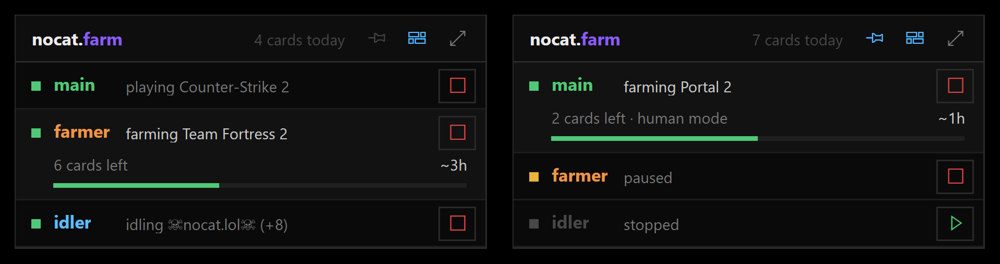
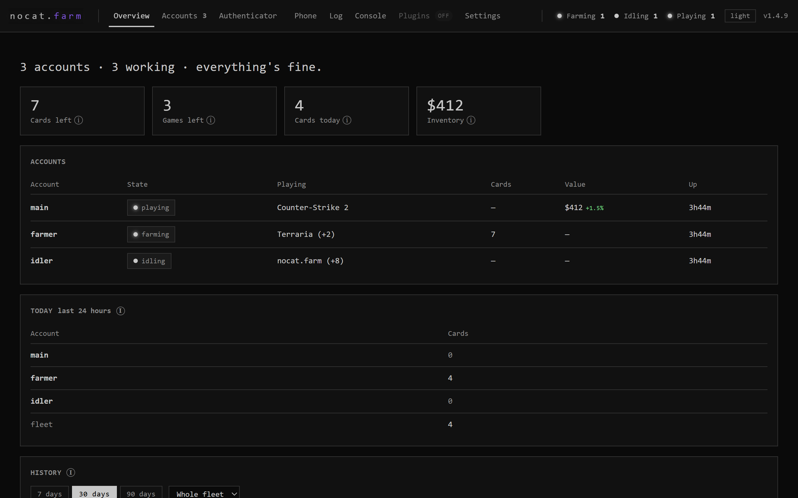

[Wiki home](README.md) · [Every command](COMMANDS.md) · [Front page](../README.md)

# The dashboard and the app window

## Dashboard tabs

The dashboard is at `http://127.0.0.1:7242/`. Its tabs, in order:

**Overview** has tiles for cards left, games left, cards today and inventory value, then an accounts table,
**Today** (the last 24 hours per account, with a total), the **History** charts and recent activity. The
**Open on your phone** and **Show the walkthrough again** links are here too.

**Accounts** has a card per account. You can search by name, login, notes or game, filter by state with the chips,
and drag cards to change the order (the app window and the console follow the same order). **Import from another
idler** and **+ Add account** are here. Removing an account asks you to type its name first.

**rep4rep** only shows when rep4rep is switched on. **Authenticator** only shows once at least one account's
authenticator is in nocat.farm, and is covered on [the Authenticator page](trades.md#the-authenticator-page). **Phone** is everything for opening the dashboard on your
phone - see [below](#using-the-dashboard-from-another-device).

**Log** is live, with search, level chips (Debug is hidden by default), an account filter, Follow and Copy.

**Console** runs the same commands as the app window. Tab completes commands and then account names, and up/down
goes through your history. A bare `help` opens a searchable command list.

**Plugins** is always there, and says "off" until plugins are turned on. See [Plugins](plugins.md).

**Settings** has search, **Show advanced**, **Only changed**, a "default" link beside anything you've changed, and a
**Save N changes** button. Settings marked ⟳ need a restart.

You can open a tab by its address, like `http://127.0.0.1:7242/#settings`. The others are `#overview`,
`#accounts`, `#rep4rep`, `#auth`, `#phone`, `#log`, `#console` and `#plugins`.

When you're not typing in a box, these keys switch tabs:

| Key | Goes to |
|---|---|
| `1` | Overview |
| `2` | Accounts |
| `3` | rep4rep (Overview when rep4rep is off) |
| `4` | Log |
| `5` | Console |
| `6` | Settings |
| `` ` `` | Console |
| `Esc` | Closes a dialog |

Authenticator, Phone and Plugins have no number key.

The dashboard comes in a dark and a light theme (the *theme* button under the tabs, or `theme light`).
It's set in Consolas. Phones and Linux usually don't have that font, so the dashboard ships its own JetBrains Mono
for them instead of falling back to whatever monospace font is around.

## The app window (Windows)

The title bar has *mini*, *hide* and *quit*. The toolbar under it has *start all*, *stop all*, *dashboard*,
*accounts* and *commands*, and says how many accounts are signed in. The accounts panel lists each account with
start/stop, pause/resume, cards and profile buttons, plus *+ add account*. At the bottom is the command line: type a
command and press Enter, or type `help` for the list.

Closing the window (or *hide*) sends it to the tray if there's a tray icon; without one, closing quits. The window
remembers its size and position.

## Mini mode

Click *mini*, type `mini`, or use the tray menu. The window shrinks to a small panel with one line per account:
what it's doing and a start/stop button. A farming account also shows cards left, time left and a progress bar.

The mini title bar has a pin that keeps it above other windows (the *Keep mini mode on top* setting, off by
default), a button for the dashboard, and one back to the full window. It remembers where you put it, and opens in
mini mode next time if you left it that way.

<p align="center">
  
</p>

## Tray

Left- or right-click the icon for the menu: Open dashboard, Hide/Show the window, Mini mode/Full window, Start all
accounts, Stop all accounts and Exit nocatFarm. Double-clicking shows the window.

*Start hidden* (a setting) or `--minimized` starts straight to the tray. *Start with Windows* adds a start-up entry
for your own Windows user.

## Console mode

`--no-gui` (or `--console`) runs without the window. You get a live board with a row per account and the last few
log lines under it. Up/down goes through your recent commands and Esc clears the line. On Linux this is what you
always get.

## Using the dashboard from another device

Out of the box the dashboard only answers this PC. The **Phone** tab is where you change that, and it's also where
the **Open on your phone** buttons elsewhere in the dashboard lead.

At the top are two cards. *At home* is the link for a phone on the same wifi. *Away from home* is the link for
mobile data, once *Open from anywhere* is on. Each shows its link as a QR code to scan with the phone's camera, with a
Copy button beside it. Until everything the link needs is in place, the code is covered with "Not ready yet".

Under them, a **Ready?** checklist ticks itself off as things get fixed, and puts the fix next to anything that isn't
done:

1. **Dashboard password.** A box to set one, with a strength meter. It's never shown, only replaced. At least 8
   characters, and 12 or more for away from home.
2. **Open to other devices.** A switch that sets *Listen on* to `0.0.0.0` (or back to `127.0.0.1`). The dashboard
   has to restart to pick that up, so a **Restart the dashboard now** button appears. Only the web page restarts -
   your accounts stay signed in. You can't switch this off from the phone itself, since that would lock the phone
   out.
3. **Windows Firewall.** If your phone just keeps loading, Windows is blocking it; many PCs are set not to ask.
   **Allow through Windows Firewall** lets in only the dashboard's port, only on home networks, after Windows asks
   you to confirm. The rule is called "nocat.farm dashboard" if you ever want to remove it. In Docker this line is
   the computer's address instead (see [Docker](linux-docker-vps.md#docker)).
4. **Router** (away from home only). Ticked once the port is being forwarded.

The page also connects Telegram and Discord, which reach your accounts from anywhere with no router involved, and
lists a few handy commands (`/status`, `/cards`, `/pause`, `/resume`, `/dashboard`, `/help`). A short safety note
at the bottom sums up what's exposed and has a button to turn *Open from anywhere* off.

A phone that signs in stays signed in for 7 days (*Stay signed in for*). Five wrong passwords lock that address out
for an hour. On this PC itself the lockout is only a minute, since whoever is at the PC can open the config folder
anyway. A reverse proxy on the same PC, like Caddy for HTTPS, makes every visitor look like this PC, so there
nocat.farm goes by the address the proxy passes on, and each visitor gets the full hour. `unlock` lifts every lockout at once. Without
a password the dashboard refuses everything that isn't this PC, even when it's open to the network. A banner warns
you if the password is short enough to guess.

**From anywhere.** Turning on *Open from anywhere* (on the Phone page, or Settings → Dashboard with Show advanced)
works like Jellyfin. nocat.farm asks your router to forward the dashboard's port to this PC (UPnP), finds your
internet address, and gives you a link and QR code that work anywhere. It needs a password of at least 12
characters, because anyone on the internet can reach the sign-in page. The link is plain http, so use a password you
don't use anywhere else. The forward is taken away when you turn it off or close nocat.farm, and put back when it
starts. Test it on mobile data with the phone's wifi off - from inside your own home, your internet address often
won't open, and that's the router, not nocat.farm. If your router has UPnP switched off, the page says so; forward
the port by hand and put your address in *Public address* instead (a name like `myname.duckdns.org` works too).

The same can be done by typing:

```
set WebPassword something-long-and-your-own
set WebHost 0.0.0.0
```

then restarting. `dashboard` in the console, and `/dashboard` on Telegram and Discord, give the same links as the
Phone page and say what's still missing.

To turn the dashboard off completely, `set WebEnabled false` and restart. Everything keeps working from the console.

<p align="center">
  
</p>

---

[← Start here](start-here.md) · [Accounts and signing in →](accounts.md)
